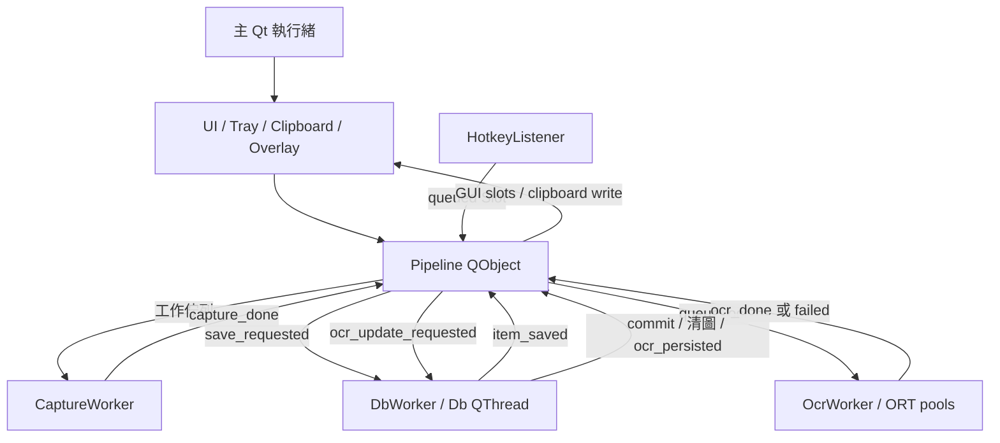

# 修復候選實際架構

此文件描述修復分支；v1.6.1 的完整取證圖及49項問題見 [baseline](audit-baseline/CURRENT_ARCHITECTURE.md)。Windows實機配置仍需驗收。

`run.bat → src/main.py → src/app.py::main`。main.py 的 `--self-test` 走實際模型／Qt／SQLite probe；`--smoke-app` 走真正 app.main、模型載入、正常退出，以臨時 `DESKTOP_OCR_HOME` 避免改動使用者資料。一般啟動載入 ConfigManager；`single_instance` 控制 Windows mutex。日志／config/data 放EXE旁可寫目錄（或明確指定的 DESKTOP_OCR_HOME），模型從 source root 或 `_MEIPASS` 校驗 manifest 載入。

## 所有權與資料邊界

| 物件 | 實際執行位置 | 限制 |
|---|---|---|
| QWidget、QClipboard、CaptureOverlay、Pipeline | main Qt | GUI/剪貼簿只在此操作；Pipeline slots 有 QObject affinity |
| HotkeyListener.run | native QThread | Windows註冊／輪詢／解除熱鍵；stop Event；GUI action交由Pipeline Slot |
| CaptureWorker.run | 單一持續 QThread | Queue最多64 pending tasks，逐張存PNG／thumb／SHA256；MSS每次用自己的context |
| OcrWorker.run | 單一持續 QThread | 引擎load及推論在同thread；設定只重啟套用；ORT每session有nativepool |
| DbWorker | moveToThread 的 QThread event loop | capture／OCR／主控台批次writes；commit後才emit持久化結果 |
| Database／repositories | main與Db thread各自connection | 寫入交易鎖＋rollback。Editor／Tag／部分pin仍同步GUI寫入，不能宣稱全部DbWorker |
| settings／editor | GUI QObject ownership | settings exec finally deleteLater；editor DeleteOnClose及dict destroyed removal |

## Persistence

Capture→保存raw／thumbnail→exact RGB hash→DbWorker dedup或insert。dedup拒收清理本次產生的圖，但刪檔失敗仍須後續reconciliation。OCR result帶入engine/model hash；失敗轉failed DTO而不刪原圖。commit成功後，只有`save_raw_image=false`且結果有文字且done/needs_review，才unlink raw並clear path／重算item_type。unlink失敗不clear path。縮圖仍保留到刪除項目。

相對圖片路徑經FileManager containment，ZIP先驗證附件路徑，CSV危險字首文字化。SQLite/FTS仍為明文；沒有自動retention。硬刪除與檔案刪除不是跨媒介原子交易，崩潰／鎖檔仍有待修復窗口。

## Shutdown

Tray quit→Pipeline.shutdown：停止GUI接受新操作、暫停clip、停止Hotkey、Capture.stop sentinel。Capture finished在GUI收完先前capture_done後送DB barrier；DB的item_saved已排OCR後，barrier停止OCR。OCR finished後送第二DB barrier，完成所有結果寫入；Db thread quit＋join；最後Database.close→shutdown_finished→QApplication.quit。aboutToQuit以nested QEventLoop維持queued callbacks直到drain；不以忽略wait timeout或terminate當成功。

## 設定與包裝

模型權重不變，實際manifest→RapidOCR kwargs；配置中`model_*`不再被說成可任意切換。Core application不instantiate optional providers，也不在設定dialog import它們。獨立adapter的3.x contract修复不等於native部署驗收。

PyInstaller onefile包含模型manifest／ONNX、ORT、Qt與必需資料，runtime hook先opt-out telemetry。WindowsCI驗證frozen模型及完整app lifecycle；乾淨無安裝電腦、mixed DPI、現場工作流程仍是獨立gate。
