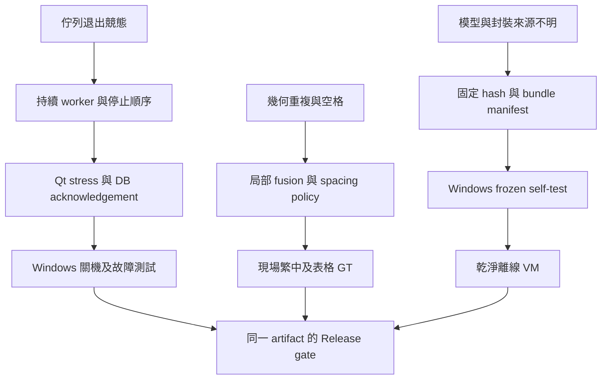

# 1.7.0-rc.2 更新

2026-10-08：修正待確認結果自動複製與三個預設關閉的複製清理勾選，保留狀態、候選與原始／人工文字。功能修正的本機Linux／offscreen完整suite為588 passed、10 PowerShell-only skipped、0 failed；新增33項copy／focus／data／settings回歸。原生source self-test與完整app lifecycle在Linux socket-deny下通過。這些不是Windows外部Ctrl+V／SendInput或乾淨機驗收。

版本、固定發布分支與精確marker更新後，rc.2必須重新通過同一SHA的Windows／Linux CI、source/frozen/firewall及雙模型各500次推論；實際結果由 [Release](https://github.com/maotai11/desktop-ocr-tool/releases/tag/v1.7.0-rc.2) 同run validation metadata與SHA256SUMS核對。clean-machine／mixed-DPI gates維持開放，僅發布為prerelease，不能沿用rc.1的驗收結果。詳見 [rc.2說明](RELEASE_1_7_0_RC2.md)。

以下保留先前版本的歷史驗證：

# 1.7.0-rc.1 更新

2026-10-06：新版本已改為可選 PP-OCRv6 Small／Medium 辨字、Small 找字；不提供舊文字模型 fallback。新增小ROI背景補邊及有上限的待確認重辨。當前驗證與限制見 [升級報告](OCR_UPGRADE_20261006.md)；Windows frozen 候選已通過 563 tests＋雙模型各500次；乾淨機器 gate 仍未完成。詳見 [Windows 驗證摘要](validation/v1.7.0-rc.1-prepublication.json)，Release 成品依同一run報告判定。

以下為 1.6.2-rc.2 歷史紀錄，不代表新v6成品已驗收：

# v1.6.2-rc.2 預發布啟用候選

384本機tests passed、0 failed、0 skipped，9.03s；包含68個mocked publication contracts，沒有用mock tests冒充live GitHub發佈。前一dcad28c的push/PR Windows與Linux CI已成功，native Windows297 passed、2 POSIX-only skips，source/frozen/firewall全部passed；本次新增payload／ZIP byte核對與固定版本發布流程後，必須再次同一SHA native驗證。

使用者核准v1.6.2-rc.2預發布測試版與限定的ephemeral Actions contents:write job。仅exact push marker／固定repo／repairbranch／tag生效；both validation jobs通過後才draft-first上傳與hash核對，不合併、不改寫tag／asset。乾淨Windows／mixed DPI／罕字field／native hang／license gates維持開放；不是stable。詳見[測試版使用說明](RELEASE_RC2.md)。

---

# 1.6.2-rc.2 恢復修復狀態（2026-10-03）

從確實已推送的bba210ec重建；沒有取得先前未推送的192-test工作位元組。最終本機Linux完整suite：299 passed、0 failed、0 skipped，8.73s；`evidence/recovery/final-tests.xml`。Compileall、fatal/redefinition Ruff、pip check及diff-check均通過；不是全量style lint清零。

最終source self-test／full app startup/shutdown在verified Linux seccomp native network-syscall EPERM guard下通過，模型／Qt／SQLite／所有worker停止受驗證。没有ptrace/network trace／Windows clean-machine證據。七張固定像素配對與52個OCR regressions、35個data regressions見[本輪報告](RECOVERY_REPAIR_REPORT.md)及[OCR明細](OCR_RECOVERY_20261003.md)。罕字仍失敗，models不變。

本輪Windows CI及downloadable candidate尚待同一推送commit驗證；以PR／Actions實際結果為準。保持Draft；clean offline Windows、mixed DPI、field accuracy與native hang isolation仍阻擋正式交付。

---

下方為rc.1歷史紀錄，不是rc.2的新驗收結果。

# 1.6.2-rc.1 修復與交付狀態

基準 master：`f5af545cabc4e9a649cd57497fbf5bf42f2ff138`。修復分支：`fix/offline-release-hardening`。日期：2026-10-02。

**候選版本；尚不可宣稱所有問題解決或已通過 Production Release。**

- CONFIRMED：基準測試 133 collected、116 passed、17 failed。
- CONFIRMED：修復候選本機完整 pytest 已執行；目前156 passed、0 failed、0 skipped；最新精確結果見 `docs/evidence/full.xml`，涵蓋原測試修正與新增對抗性測試。測試數量不是功能完成證據。
- CONFIRMED：Linux Qt offscreen 的 source self-test 真實載入三個固定模型、OCR known text、SQLite 寫入；結果見 `docs/evidence/source-selftest.json`。
- CONFIRMED：實際 QThread 排程與 shutdown barrier 測試；模型載入期間要求退出，40 個 capture→DB→OCR→DB 工作全部持久化。
- CONFIRMED：commit `1a843fe` 的 Linux／Windows CI、source self-test、Windows full app startup/shutdown、PyInstaller one-file build 及 outbound-blocked frozen self-test／app smoke 全部通過；見 Actions run 37008203276。此 run 的 Qt platform 為 offscreen；後續 CI 將 Windows 改為 qwindows 原生平台並重跑，不把 offscreen 當原生視窗驗收。
- UNKNOWN：乾淨 Windows 離線電腦、mixed DPI、原始 Microsoft 連線 payload。
- 尚未結案：稀有字／小字 Detection 漏辨、domain correction、旋轉／表格 fusion、長條圖片切片、retention、未接線設定、Windows lifecycle 現場行為。

## 已實作的修復

1. 邊界工作佇列改為單一持續 QThread，有限待辦容量，停止後拒收並依序排空。GUI thread 的 Pipeline QObject 收送 slots；DB acknowledgement 後才清圖／複製。退出採 Capture→DB barrier→OCR→DB barrier→DB thread join→close。
2. 每執行緒 SQLite connection、寫入鎖／回滾；資料與 FTS 的失敗回滾、4 個執行緒共 200 次寫入受測。Editor／Tag 仍由 GUI 呼叫 repository，文件不再宣稱所有寫入都走 DbWorker。
3. OCR provenance 由結果帶入；Core 模型 hash 實際核驗並傳進 RapidOCR。空 edited_text 不回退原文、清圖更新 item_type、failed／empty 保留原圖、exact image hash 取代 pHash 去重。
4. 文字 spacing ground truth；second-pass overlap component 單一 hypothesis 仲裁。未更換模型／未啟用全域錯字替換。
5. 檔案路徑／symlink 越界拒絕、CSV 公式字首文字化、匯出名稱避免覆寫、ZIP 附件避免同名碰撞。CSV 的負號開頭也以文字匯出，JSON／TXT 保留原字串。
6. 設定對話框 tag import／更新／計數、主控台全部匯出錯誤、關閉 settings/editor 的 QObject 釋放、擷取取消恢復、卡片 PlainText 與鍵盤動作、次要字色。
7. 移除未接線引擎選擇 UI、停用未實作控制項；OCR 參數改為重啟套用，避免 GUI 同時修改正在推論的引擎。
8. 固定 Core dependency versions、清除 build 收集／排除矛盾、內含 verified models、runtime telemetry hook、frozen self-test 與 CI 候選 artifact。

## 修正依賴與剩餘 gate

本次沒有用新的 abstraction 宣稱已消除全部根因；QueueWorker／Pipeline 分別承擔唯一 worker lifetime 與 Qt dispatch/shutdown ownership。對沒有 runtime 證據的 Windows／optional provider／memory leak freedom 維持 UNKNOWN。每一個開放項目仍需對應 Ground Truth、profiler 或現場 gate。

完整49項逐項狀態：[MASTER_FINDINGS](MASTER_FINDINGS.md)。效能原始量測：[PERFORMANCE_VALIDATION](PERFORMANCE_VALIDATION.md)；模型與spacing證據：[OCR_REPAIR_VALIDATION](OCR_REPAIR_VALIDATION.md)。

CONFIRMED：本地500次settings close後0個SettingsDialog QObject；100次editor close後索引為空且0個EditorWindow child。這是物件釋放驗證，不是整體RSS改善聲明。
