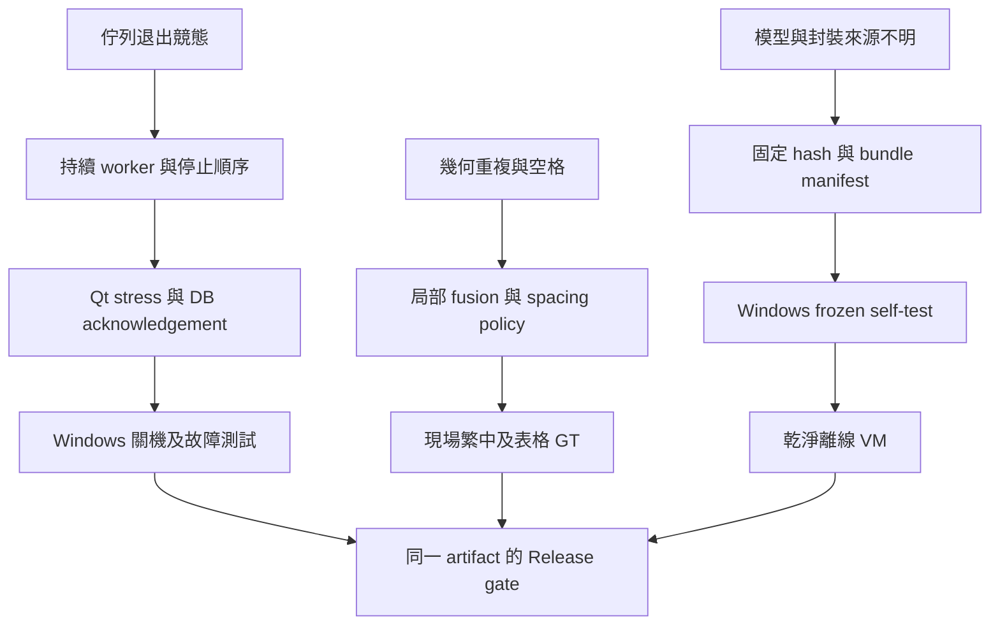

# 1.6.2-rc.1 修復與交付狀態

基準 master：`f5af545cabc4e9a649cd57497fbf5bf42f2ff138`。修復分支：`fix/offline-release-hardening`。日期：2026-10-02。

**候選版本；尚不可宣稱所有問題解決或已通過 Production Release。**

- CONFIRMED：基準測試 133 collected、116 passed、17 failed。
- CONFIRMED：修復候選本機完整 pytest 已執行；最新精確結果見 `docs/evidence/full.xml`，涵蓋原測試修正與新增對抗性測試。測試數量不是功能完成證據。
- CONFIRMED：Linux Qt offscreen 的 source self-test 真實載入三個固定模型、OCR known text、SQLite 寫入；結果見 `docs/evidence/source-selftest.json`。
- CONFIRMED：實際 QThread 排程與 shutdown barrier 測試；模型載入期間要求退出，40 個 capture→DB→OCR→DB 工作全部持久化。
- UNKNOWN：Windows Actions 結果、乾淨 Windows 離線電腦、mixed DPI、原始 Microsoft 連線 payload。
- 尚未結案：稀有字／小字 Detection 漏辨、domain correction、旋轉／表格 fusion、長條圖片切片、retention、未接線設定、Windows lifecycle 現場行為。

## 已實作的修復

1. 邊界工作佇列改為單一持續 QThread，有限待辦容量，停止後拒收並依序排空。GUI thread 的 Pipeline QObject 收送 slots；DB acknowledgement 後才清圖／複製。退出採 Capture→DB barrier→OCR→DB barrier→DB thread join→close。
2. 每執行緒 SQLite connection、寫入鎖／回滾；資料與 FTS 的失敗回滾、4 個執行緒共 200 次寫入受測。Editor／Tag 仍由 GUI 呼叫 repository，文件不再宣稱所有寫入都走 DbWorker。
3. OCR provenance 由結果帶入；Core 模型 hash 實際核驗並傳進 RapidOCR。空 edited_text 不回退原文、清圖更新 item_type、failed／empty 保留原圖、exact image hash 取代 pHash 去重。
4. 文字 spacing ground truth；second-pass overlap component 單一 hypothesis 仲裁。未更換模型／未啟用全域錯字替換。
5. 檔案路徑／symlink 越界拒絕、CSV 公式字首文字化、匯出名稱避免覆寫、ZIP 附件避免同名碰撞。CSV 的負號開頭也以文字匯出，JSON／TXT 保留原字串。
6. 設定對話框 tag import／更新／計數、主控台全部匯出錯誤、關閉 settings/editor 的 QObject 釋放、擷取取消恢復、卡片 PlainText 與鍵盤動作、次要字色。
7. 移除未接線引擎選擇 UI、停用未實作控制項；OCR 參數改為重啟套用，避免 GUI 同時修改正在推論的引擎。
8. 固定 Core dependency versions、清除 build 收集／排除矛盾、內含 verified models、runtime telemetry hook、frozen self-test 與 CI 候選 artifact。

## 修正依賴與剩餘 gate

本次沒有用新的 abstraction 宣稱已消除全部根因；QueueWorker／Pipeline 分別承擔唯一 worker lifetime 與 Qt dispatch/shutdown ownership。對沒有 runtime 證據的 Windows／optional provider／memory leak freedom 維持 UNKNOWN。每一個開放項目仍需對應 Ground Truth、profiler 或現場 gate。
