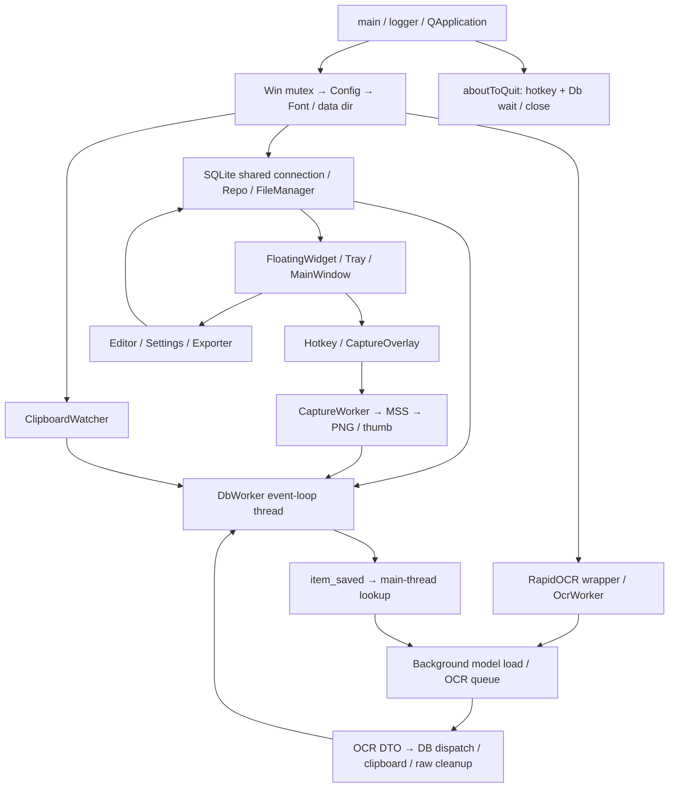

# Current Architecture Verification

審計對象：`maotai11/desktop-ocr-tool`，master 固定為 `f5af545cabc4e9a649cd57497fbf5bf42f2ff138`（v1.6.1）。檢查日期：2026-10-02；原始程序時鐘與 UTC 紀錄見 evidence。產品 source 未修改。

證據標記：**CONFIRMED**＝可定位的程式／實測；**INFERRED**＝原因或實際影響仍缺現場證據；**UNKNOWN**＝本環境無法驗證。程式存在不等於功能接線，合成測試不等於現場準確率。每項 issue 的完整影響、修正驗證與 regression 在 [MASTER_FINDINGS.md](MASTER_FINDINGS.md)。

環境為 Linux x86_64、Python 3.12、Qt offscreen；不是 Windows clean machine。原始 core requirements 的測試環境及後續 optional benchmark 環境分別記錄於 `evidence/pip-freeze.txt`、`evidence/benchmark-pip-freeze.txt`。後者 cv2 已被 Paddle 相依 wheel 改寫，不能跨環境比較 latency。所有完成的 OCR 量測均先設定 ORT opt-out 並使用 syscall 網路阻斷。

## 實際入口與組件

CONFIRMED：`run.bat` 切到repo根→`python src\main.py`→src/main.py修sys.path→setup_logger→src/app.py.main。src/main.py與app都呼叫logger setup，但initializedguard避免重複handlers。README的python main.py不是存在的入口。

| Area | Actual producer/consumer | Evidence / difference |
|---|---|---|
| Startup | QApplication→alwaysmutex→Config→SQLite→threads→UI/tray→clipboard/hotkeys→start_loading→exec | source, shutdown actualapp platformstubs；nativeWin unknown |
| Config | Pythondefault + settings.json merge, atomic os.replace save | bundleddefaultJSON不read；每UIset寫全檔 |
| Capture | Overlay只有Qtprimary→MSS固定index1；worker每次新msscontext | screen/DPR/MSS mapping未Win測；frameBGRA→BGR slice→RGB/PILcopy |
| OCR | packagev4→shortsideupscale→firstpass→optionalfixedsecond→append→zhconv→sort→optionalfallback | 无dictionarycontext；candidatefilter先發生於vendor |
| Clipboard | watcher.changed只Clipboard模式→textsignal有consumer；imageemit空串無consumer | ownMIME ignore；appcopyOCR結果用writerMIME |
| Database | one SQLiteconn main建立(check_same_thread=False), WAL NORMAL,FTS triggers | DbWorker＋Editor/widget/tag直接write，非全worker |
| File storage | datadircaptures/thumbnails/annotations/exports；rawcompletioncleanup | region_ocr存圖即使save_raw_imagefalse；thumb保留 |
| Export | UI current/all→syncExporter TXT/CSV/JSON/ZIP | allbadattribute；raw cleanup後ZIP不包括thumb；same秒overwrite |
| Tray | generatedQPixmapicon，show/toggle/console/capture/pause/quit | nativeexplorerrestart/Winshutdown未知 |
| Hotkey | Win RegisterHotKey in HotkeyListener.run message loop→signal→appactions | sixactions，quick_search未register；failurelog無可見feedback |
| Shutdown | onlyhotkey.stop＋dbquit/wait2000＋dbclose＋mutexrelease | noOCR/capturejoin, waitboolignored；realQtcrash134 |
| Packaging | scripts/build.pyverifyrepoONNX→PyInstalleronefile→releaseZIP | 未tracked spec；frozenconfig/data/log在exe旁，模型package在_MEIPASS |

## Ownership 與 dispatch 語義

Main Qtthread擁有UI、ClipboardWatcher、Overlay、worker QThread物件本身。CaptureWorker/OcrWorker/HotkeyListener的run在各nativeworkerthread；QThread物件的Qt affinity並不自動變runthread。DbWorker明確moveToThread至有exec eventloop的Dbthread。OcrEngine普通Python物件在main建立、OcrWorker載入与推論；Settings主threadconfigure/set_secondary可與run交錯，現場race尚UNKNOWN。ORT每det/rec/cls session有自己的pool，數量需用profiler不是Pythonthreadenumerate。

app.cpp風格free-function/lambda signalreceivers的執行thread不能只看寫在main函式就判main；目前敏感寫UI/Db路徑多使用three-arg QTimer.singleShot(0, context, functor)，已在lifecycle實測Dbcallback走Dbthread。MainWindow請求signals→DbWorker slots是真queuedaffinity；Editor、widgetpin、tagwrite是直接主thread调用。

| Boundary | Real chain | Dispatch / limitation |
|---|---|---|
| Capture done | capture_done→on_capture_done→singleShot(widget.show)＋singleShot(db_worker.save_item) | context選main/Dbthread |
| Saved | item_saved→on_item_saved→singleShot(widget,_update)→repo lookup→queue_ocr | lookupmain，共享conn |
| OCR done | ocr_done→on_ocr_done→singleShot(Dbupdate)＋singleShot(widgetclipboard)＋立即rawremove | queue≠commit，cleanup順序見D02 |
| Engine progress | engine_progress→widget.on_ocr_engine_progress / ready / failed | GUIreceivermethod應queued，offscreenprobe可驗 |
| Worker internal | start_loading/queue→start→run(load/drain)→timeoutreturn | 不是持續eventloop，C01窗口 |
| Quit | aboutToQuit→_on_quit→hotkey.wait2000/dbwait2000 | OCR/capture及pendingtimers未協调 |

## 所有 Qt dispatch 源碼清冊

下表逐個列出tracked source的connect/emit/singleShot/moveToThread/start/wait/quit calls（含非Qt同名call，避免漏掉再靠人工解讀）。未用字串count宣稱每一個已在Windows動態覆蓋。另列declaredsignal，有signal但無emit/consumer不當作功能。

| File:line | Call expression |
|---|---|
| src/app.py:237 | `hotkey_listener.hotkey_pressed.connect(on_hotkey)` |
| src/app.py:238 | `hotkey_listener.start()` |
| src/app.py:249 | `capture_worker.capture_done.connect(on_capture_done)` |
| src/app.py:250 | `capture_worker.capture_failed.connect(             lambda err: QMessageBox.warning(None, "截圖失敗", err)         )` |
| src/app.py:267 | `db_worker.item_saved.connect(on_item_saved)` |
| src/app.py:268 | `db_worker.item_updated.connect(             lambda _: QTimer.singleShot(0, widget, widget.refresh_list)         )` |
| src/app.py:271 | `db_worker.save_failed.connect(             lambda err: QTimer.singleShot(                 0, widget, lambda: widget.set_ocr_status(f"儲存失敗: {err}")             )         )` |
| src/app.py:318 | `ocr_worker.ocr_done.connect(on_ocr_done)` |
| src/app.py:319 | `ocr_worker.ocr_failed.connect(on_ocr_failed)` |
| src/app.py:320 | `ocr_worker.ocr_progress.connect(widget.set_ocr_progress)` |
| src/app.py:321 | `ocr_worker.engine_progress.connect(widget.on_ocr_engine_progress)` |
| src/app.py:322 | `ocr_worker.engine_ready.connect(widget.on_ocr_engine_ready)` |
| src/app.py:323 | `ocr_worker.engine_failed.connect(widget.on_ocr_engine_failed)` |
| src/app.py:333 | `app.aboutToQuit.connect(_on_quit)` |
| src/app.py:245 | `QTimer.singleShot(0, widget, widget.show)` |
| src/app.py:247 | `QTimer.singleShot(0, db_worker, lambda: db_worker.save_item(dto))` |
| src/app.py:265 | `QTimer.singleShot(0, widget, _update)` |
| src/app.py:299 | `QTimer.singleShot(0, db_worker, lambda: db_worker.update_ocr(item_id, result))` |
| src/app.py:311 | `QTimer.singleShot(0, widget,                               lambda: widget.set_ocr_status(f"OCR #{item_id} 失敗"))` |
| src/app.py:328 | `db_thread.quit()` |
| src/app.py:329 | `db_thread.wait(2000)` |
| src/app.py:187 | `clip_watcher.text_captured.connect(on_clipboard_text)` |
| src/app.py:269 | `QTimer.singleShot(0, widget, widget.refresh_list)` |
| src/app.py:272 | `QTimer.singleShot(                 0, widget, lambda: widget.set_ocr_status(f"儲存失敗: {err}")             )` |
| src/app.py:294 | `QTimer.singleShot(0, db_worker,                                   lambda iid=item_id: db_worker.clear_image_paths(iid))` |
| src/app.py:301 | `QTimer.singleShot(0, widget, lambda: widget.set_ocr_status("OCR 失敗"))` |
| src/app.py:185 | `QTimer.singleShot(0, db_worker, lambda dto=dto: db_worker.save_item(dto))` |
| src/app.py:306 | `QTimer.singleShot(0, widget, lambda: write_text_to_clipboard(text))` |
| src/clipboard/watcher.py:19 | `self._clipboard.changed.connect(self._on_changed)` |
| src/clipboard/watcher.py:48 | `self.text_captured.emit(text)` |
| src/clipboard/watcher.py:51 | `self.image_captured.emit('')` |
| src/core/hotkey.py:104 | `self.quit()` |
| src/core/hotkey.py:105 | `self.wait(2000)` |
| src/core/hotkey.py:98 | `self.hotkey_pressed.emit(self._hotkeys[hid])` |
| src/data/database.py:113 | `sqlite3.connect(self._db_path, check_same_thread=False)` |
| src/ui/capture_overlay.py:99 | `QTimer.singleShot(150, lambda: self._callback(x, y, w, h, self._monitor_idx))` |
| src/ui/components/item_card.py:120 | `self.clicked.emit(self._item.id)` |
| src/ui/components/item_card.py:125 | `self.double_clicked.emit(self._item.id)` |
| src/ui/editor_window.py:138 | `btn_confirm.clicked.connect(self._confirm_ocr)` |
| src/ui/editor_window.py:162 | `btn_rerun.clicked.connect(self._rerun_ocr)` |
| src/ui/editor_window.py:232 | `self._btn_save_image.clicked.connect(self._save_image_as)` |
| src/ui/editor_window.py:238 | `btn_cancel.clicked.connect(self.reject)` |
| src/ui/editor_window.py:254 | `btn_save.clicked.connect(self._save)` |
| src/ui/editor_window.py:314 | `self.item_updated.emit(self._item.id)` |
| src/ui/editor_window.py:292 | `self.item_updated.emit(self._item.id)` |
| src/ui/editor_window.py:303 | `self.item_updated.emit(self._item.id)` |
| src/ui/main_window.py:195 | `self._side_list.currentItemChanged.connect(self._on_category_changed)` |
| src/ui/main_window.py:219 | `self._search.returnPressed.connect(self._do_search)` |
| src/ui/main_window.py:221 | `btn_search.clicked.connect(self._do_search)` |
| src/ui/main_window.py:244 | `self._btn_toggle_batch.clicked.connect(self._toggle_batch_mode)` |
| src/ui/main_window.py:291 | `_btn_all.clicked.connect(lambda: self._table.selectAll())` |
| src/ui/main_window.py:296 | `_btn_clear.clicked.connect(lambda: self._table.clearSelection())` |
| src/ui/main_window.py:302 | `self._btn_batch_delete.clicked.connect(self._delete_selected)` |
| src/ui/main_window.py:307 | `_btn_exit.clicked.connect(lambda: self._toggle_batch_mode(False))` |
| src/ui/main_window.py:351 | `self._table.currentCellChanged.connect(             lambda curr_row, _cc, _pr, _pc: self._on_row_changed(curr_row)         )` |
| src/ui/main_window.py:355 | `self._table.customContextMenuRequested.connect(self._on_table_context_menu)` |
| src/ui/main_window.py:356 | `self._table.selectionModel().selectionChanged.connect(self._on_selection_changed)` |
| src/ui/main_window.py:394 | `btn_copy.clicked.connect(self._copy_selected)` |
| src/ui/main_window.py:404 | `btn_delete.clicked.connect(self._delete_selected)` |
| src/ui/main_window.py:440 | `export_menu.addAction("TXT 純文字...").triggered.connect(lambda: self._export_with_dialog('txt'))` |
| src/ui/main_window.py:441 | `export_menu.addAction("CSV (Excel 相容)...").triggered.connect(lambda: self._export_with_dialog('csv'))` |
| src/ui/main_window.py:442 | `export_menu.addAction("JSON...").triggered.connect(lambda: self._export_with_dialog('json'))` |
| src/ui/main_window.py:443 | `export_menu.addAction("ZIP (文字+圖片)...").triggered.connect(lambda: self._export_with_dialog('zip'))` |
| src/ui/main_window.py:446 | `file_menu.addAction("關閉").triggered.connect(self.close)` |
| src/ui/main_window.py:449 | `edit_menu.addAction("複製文字").triggered.connect(self._copy_selected)` |
| src/ui/main_window.py:450 | `edit_menu.addAction("刪除（移至垃圾桶）").triggered.connect(self._delete_selected)` |
| src/ui/main_window.py:452 | `edit_menu.addAction("清理已刪除...").triggered.connect(self._clear_deleted)` |
| src/ui/main_window.py:456 | `self.request_soft_delete.connect(self._db_worker.soft_delete_items)` |
| src/ui/main_window.py:457 | `self.request_set_pinned.connect(self._db_worker.set_pinned)` |
| src/ui/main_window.py:458 | `self.request_set_archived.connect(self._db_worker.set_archived)` |
| src/ui/main_window.py:459 | `self.request_purge.connect(self._db_worker.purge_soft_deleted)` |
| src/ui/main_window.py:460 | `self._db_worker.items_soft_deleted.connect(self._on_items_soft_deleted)` |
| src/ui/main_window.py:461 | `self._db_worker.item_pinned.connect(lambda *_: self._refresh_current())` |
| src/ui/main_window.py:462 | `self._db_worker.item_archived.connect(lambda *_: self._refresh_current())` |
| src/ui/main_window.py:463 | `self._db_worker.purge_done.connect(self._on_purge_done)` |
| src/ui/main_window.py:473 | `QTimer.singleShot(2000, lambda: self._status_lbl.setText("就緒"))` |
| src/ui/main_window.py:711 | `btns.accepted.connect(dlg.accept)` |
| src/ui/main_window.py:712 | `btns.rejected.connect(dlg.reject)` |
| src/ui/main_window.py:806 | `act_copy_text.triggered.connect(lambda: self._copy_item_text(item))` |
| src/ui/main_window.py:812 | `act_copy_img.triggered.connect(lambda: self._copy_item_image(item))` |
| src/ui/main_window.py:818 | `act_save_img.triggered.connect(lambda: self._save_item_image(item))` |
| src/ui/main_window.py:822 | `menu.addAction("編輯").triggered.connect(lambda: self._open_editor(item))` |
| src/ui/main_window.py:828 | `menu.addAction(pin_text).triggered.connect(             lambda checked=False, iid=item.id, val=new_pinned:                 self.request_set_pinned.emit(iid, val)         )` |
| src/ui/main_window.py:835 | `menu.addAction(arch_text).triggered.connect(             lambda checked=False, iid=item.id, val=new_archived:                 self.request_set_archived.emit(iid, val)         )` |
| src/ui/main_window.py:842 | `menu.addAction("刪除（移至垃圾桶）").triggered.connect(             lambda checked=False, iid=item.id:                 self.request_soft_delete.emit([iid])         )` |
| src/ui/main_window.py:867 | `QTimer.singleShot(2000, lambda: self._status_lbl.setText("就緒"))` |
| src/ui/main_window.py:897 | `editor.item_updated.connect(lambda _: self._refresh_current())` |
| src/ui/main_window.py:898 | `editor.destroyed.connect(             lambda: self._editor_windows.pop(item.id, None)         )` |
| src/ui/main_window.py:609 | `QTimer.singleShot(2000, lambda: self._status_lbl.setText("就緒"))` |
| src/ui/main_window.py:632 | `self.request_soft_delete.emit(ids)` |
| src/ui/main_window.py:650 | `self.request_purge.emit()` |
| src/ui/main_window.py:801 | `act_del_batch.triggered.connect(self._delete_selected)` |
| src/ui/main_window.py:858 | `QTimer.singleShot(2000, lambda: self._status_lbl.setText("就緒"))` |
| src/ui/main_window.py:830 | `self.request_set_pinned.emit(iid, val)` |
| src/ui/main_window.py:837 | `self.request_set_archived.emit(iid, val)` |
| src/ui/main_window.py:844 | `self.request_soft_delete.emit([iid])` |
| src/ui/settings_dialog.py:334 | `self._sec_provider.currentIndexChanged.connect(self._update_sec_diag)` |
| src/ui/settings_dialog.py:440 | `btn_box.accepted.connect(self._save)` |
| src/ui/settings_dialog.py:441 | `btn_box.rejected.connect(self.reject)` |
| src/ui/settings_dialog.py:597 | `self._btn_add_tag.clicked.connect(self._add_tag_dialog)` |
| src/ui/settings_dialog.py:598 | `self._btn_edit_tag.clicked.connect(self._edit_tag_dialog)` |
| src/ui/settings_dialog.py:599 | `self._btn_delete_tag.clicked.connect(self._delete_tag_confirm)` |
| src/ui/settings_dialog.py:669 | `self._new_tag_color.clicked.connect(self._pick_color)` |
| src/ui/settings_dialog.py:677 | `btns.accepted.connect(dlg.accept)` |
| src/ui/settings_dialog.py:678 | `btns.rejected.connect(dlg.reject)` |
| src/ui/settings_dialog.py:729 | `self._edit_tag_color.clicked.connect(self._pick_color)` |
| src/ui/settings_dialog.py:737 | `btns.accepted.connect(dlg.accept)` |
| src/ui/settings_dialog.py:738 | `btns.rejected.connect(dlg.reject)` |
| src/ui/settings_dialog.py:642 | `action_btn.clicked.connect(lambda checked, tid=tag.id: self._apply_tag_to_selected(tid))` |
| src/ui/tray_manager.py:34 | `self._tray.activated.connect(self._on_activated)` |
| src/ui/tray_manager.py:40 | `act_show.triggered.connect(self._widget.toggle_visibility)` |
| src/ui/tray_manager.py:43 | `act_console.triggered.connect(self._widget.open_console)` |
| src/ui/tray_manager.py:48 | `act_ocr.triggered.connect(self._widget.trigger_capture_ocr)` |
| src/ui/tray_manager.py:51 | `act_ss.triggered.connect(self._widget.trigger_capture_image)` |
| src/ui/tray_manager.py:57 | `self._act_pause.triggered.connect(self._widget.toggle_clipboard_pause)` |
| src/ui/tray_manager.py:60 | `act_settings.triggered.connect(self._widget.open_settings)` |
| src/ui/tray_manager.py:65 | `act_quit.triggered.connect(QApplication.quit)` |
| src/ui/widget.py:108 | `self._btn_ocr.clicked.connect(self.trigger_capture_ocr)` |
| src/ui/widget.py:121 | `self._btn_screenshot.clicked.connect(self.trigger_capture_image)` |
| src/ui/widget.py:159 | `self._btn_settings.clicked.connect(self.open_settings)` |
| src/ui/widget.py:186 | `self._search_edit.textChanged.connect(self._on_search_text_changed)` |
| src/ui/widget.py:205 | `self._btn_newline.clicked.connect(self._insert_newline)` |
| src/ui/widget.py:263 | `self._btn_batch_select.clicked.connect(self._toggle_batch_mode)` |
| src/ui/widget.py:276 | `self._btn_batch_action.clicked.connect(self._show_batch_menu)` |
| src/ui/widget.py:314 | `self._btn_console.clicked.connect(self.open_console)` |
| src/ui/widget.py:326 | `self._btn_pause.clicked.connect(self.toggle_clipboard_pause)` |
| src/ui/widget.py:445 | `self._search_timer.start(300)` |
| src/ui/widget.py:480 | `menu.addAction("📋 批量複製").triggered.connect(self._batch_copy)` |
| src/ui/widget.py:481 | `menu.addAction("🗑️ 批量刪除").triggered.connect(self._batch_delete)` |
| src/ui/widget.py:483 | `menu.addAction("全選").triggered.connect(self._select_all)` |
| src/ui/widget.py:484 | `menu.addAction("取消全選").triggered.connect(self._deselect_all)` |
| src/ui/widget.py:659 | `act_copy_text.triggered.connect(lambda: self._on_item_copy(item.id))` |
| src/ui/widget.py:666 | `act_copy_img.triggered.connect(lambda: self._copy_item_image(item))` |
| src/ui/widget.py:673 | `act_save_img.triggered.connect(lambda: self._save_item_image(item))` |
| src/ui/widget.py:678 | `menu.addAction("編輯").triggered.connect(lambda: self._open_editor(item))` |
| src/ui/widget.py:683 | `menu.addAction(pin_text).triggered.connect(             lambda: (self._item_repo.set_pinned(item.id, not item.is_pinned),                      self.refresh_list())         )` |
| src/ui/widget.py:690 | `act_ocr.triggered.connect(lambda: self._rerun_ocr(item))` |
| src/ui/widget.py:693 | `menu.addAction("刪除").triggered.connect(lambda: self._soft_delete(item.id))` |
| src/ui/widget.py:737 | `editor.item_updated.connect(lambda _: self.refresh_list())` |
| src/ui/widget.py:738 | `editor.destroyed.connect(             lambda: self._editor_windows.pop(item.id, None)         )` |
| src/ui/widget.py:241 | `btn.clicked.connect(lambda _checked, k=key: self._set_filter(k))` |
| src/ui/widget.py:444 | `self._search_timer.timeout.connect(self._do_search)` |
| src/ui/widget.py:773 | `self._console.destroyed.connect(                 lambda: setattr(self, '_console', None)             )` |
| src/ui/widget.py:628 | `card.clicked.connect(self._handle_card_click)` |
| src/ui/widget.py:629 | `card.double_clicked.connect(self._handle_card_double_click)` |
| src/ui/widget.py:632 | `card.customContextMenuRequested.connect(                     lambda pos, i=item, c=card: self._show_item_menu(pos, i, c)                 )` |
| src/workers/capture_worker.py:34 | `self.start()` |
| src/workers/capture_worker.py:39 | `self.start()` |
| src/workers/capture_worker.py:89 | `self.capture_done.emit(abs_path, dto)` |
| src/workers/capture_worker.py:66 | `self.capture_failed.emit("截圖失敗：無法擷取畫面")` |
| src/workers/capture_worker.py:92 | `self.capture_failed.emit(str(e))` |
| src/workers/db_worker.py:119 | `worker.moveToThread(thread)` |
| src/workers/db_worker.py:120 | `thread.start()` |
| src/workers/db_worker.py:56 | `self.item_updated.emit(item_id)` |
| src/workers/db_worker.py:66 | `self.item_deleted.emit(item_id)` |
| src/workers/db_worker.py:75 | `self.items_soft_deleted.emit(item_ids)` |
| src/workers/db_worker.py:83 | `self.item_pinned.emit(item_id, value)` |
| src/workers/db_worker.py:91 | `self.item_archived.emit(item_id, value)` |
| src/workers/db_worker.py:109 | `self.purge_done.emit(n)` |
| src/workers/db_worker.py:45 | `self.item_saved.emit(item_id)` |
| src/workers/db_worker.py:47 | `self.save_failed.emit("儲存失敗")` |
| src/workers/db_worker.py:50 | `self.save_failed.emit(str(e))` |
| src/workers/ocr_worker.py:34 | `self.start()` |
| src/workers/ocr_worker.py:50 | `self.engine_loading.emit()` |
| src/workers/ocr_worker.py:40 | `self.start()` |
| src/workers/ocr_worker.py:53 | `self.engine_ready.emit()` |
| src/workers/ocr_worker.py:32 | `self.ocr_progress.emit(pct, msg)` |
| src/workers/ocr_worker.py:60 | `self.engine_failed.emit(str(e))` |
| src/workers/ocr_worker.py:83 | `self.ocr_done.emit(item_id, dto)` |
| src/workers/ocr_worker.py:71 | `self.ocr_failed.emit(item_id, "OCR 引擎未就緒")` |
| src/workers/ocr_worker.py:86 | `self.ocr_failed.emit(item_id, str(e))` |
| src/workers/ocr_worker.py:52 | `self.engine_progress.emit(pct, msg)` |

### Declared Qt signals

| File:line | Declaration |
|---|---|
| src/clipboard/watcher.py:12 | `text_captured = Signal(str)` |
| src/clipboard/watcher.py:13 | `image_captured = Signal(str)` |
| src/core/hotkey.py:51 | `hotkey_pressed = Signal(str)` |
| src/core/signals.py:6 | `capture_started = Signal()` |
| src/core/signals.py:7 | `capture_finished = Signal(str)` |
| src/core/signals.py:8 | `capture_cancelled = Signal()` |
| src/core/signals.py:10 | `ocr_engine_loading = Signal()` |
| src/core/signals.py:11 | `ocr_engine_ready = Signal()` |
| src/core/signals.py:12 | `ocr_engine_failed = Signal(str)` |
| src/core/signals.py:13 | `ocr_started = Signal(int)` |
| src/core/signals.py:14 | `ocr_finished = Signal(int, str, float)` |
| src/core/signals.py:15 | `ocr_failed = Signal(int, str)` |
| src/core/signals.py:17 | `item_saved = Signal(int)` |
| src/core/signals.py:18 | `item_updated = Signal(int)` |
| src/core/signals.py:19 | `item_deleted = Signal(int)` |
| src/core/signals.py:21 | `clipboard_item_captured = Signal()` |
| src/core/signals.py:23 | `show_widget = Signal()` |
| src/core/signals.py:24 | `hide_widget = Signal()` |
| src/core/signals.py:25 | `toggle_widget = Signal()` |
| src/core/signals.py:26 | `open_console = Signal()` |
| src/core/signals.py:27 | `show_notification = Signal(str, str)` |
| src/ui/capture_overlay.py:15 | `region_selected = Signal(int, int, int, int, int)` |
| src/ui/components/item_card.py:15 | `clicked = Signal(int)` |
| src/ui/components/item_card.py:16 | `double_clicked = Signal(int)` |
| src/ui/editor_window.py:82 | `item_updated = Signal(int)` |
| src/ui/main_window.py:117 | `request_soft_delete = Signal(list)` |
| src/ui/main_window.py:118 | `request_set_pinned = Signal(int, bool)` |
| src/ui/main_window.py:119 | `request_set_archived = Signal(int, bool)` |
| src/ui/main_window.py:120 | `request_purge = Signal()` |
| src/workers/capture_worker.py:22 | `capture_done = Signal(str, object)` |
| src/workers/capture_worker.py:23 | `capture_failed = Signal(str)` |
| src/workers/db_worker.py:16 | `item_saved = Signal(int)` |
| src/workers/db_worker.py:17 | `item_updated = Signal(int)` |
| src/workers/db_worker.py:18 | `item_deleted = Signal(int)` |
| src/workers/db_worker.py:19 | `save_failed = Signal(str)` |
| src/workers/db_worker.py:20 | `items_soft_deleted = Signal(list)` |
| src/workers/db_worker.py:21 | `item_pinned = Signal(int, bool)` |
| src/workers/db_worker.py:22 | `item_archived = Signal(int, bool)` |
| src/workers/db_worker.py:23 | `purge_done = Signal(int)` |
| src/workers/ocr_worker.py:14 | `engine_loading = Signal()` |
| src/workers/ocr_worker.py:15 | `engine_progress = Signal(int, str)` |
| src/workers/ocr_worker.py:16 | `engine_ready = Signal()` |
| src/workers/ocr_worker.py:17 | `engine_failed = Signal(str)` |
| src/workers/ocr_worker.py:18 | `ocr_done = Signal(int, object)` |
| src/workers/ocr_worker.py:19 | `ocr_failed = Signal(int, str)` |
| src/workers/ocr_worker.py:20 | `ocr_progress = Signal(int, str)` |

AppSignals整個bus無import；CaptureOverlay.region_selected未emit；OcrWorker.engine_loading有emit但app無consumer；DbWorker.item_deleted等不是所有UI都connect。詳見orphan。
