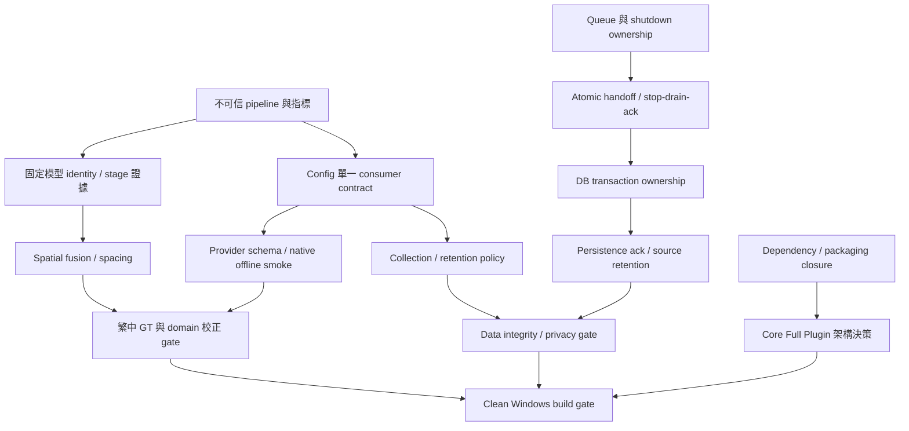

# Master Forensic Findings

審計對象：`maotai11/desktop-ocr-tool`，master 固定為 `f5af545cabc4e9a649cd57497fbf5bf42f2ff138`（v1.6.1）。檢查日期：2026-10-02；原始程序時鐘與 UTC 紀錄見 evidence。產品 source 未修改。

證據標記：**CONFIRMED**＝可定位的程式／實測；**INFERRED**＝原因或實際影響仍缺現場證據；**UNKNOWN**＝本環境無法驗證。程式存在不等於功能接線，合成測試不等於現場準確率。每項 issue 的完整影響、修正驗證與 regression 在 [MASTER_FINDINGS.md](MASTER_FINDINGS.md)。

環境為 Linux x86_64、Python 3.12、Qt offscreen；不是 Windows clean machine。原始 core requirements 的測試環境及後續 optional benchmark 環境分別記錄於 `evidence/pip-freeze.txt`、`evidence/benchmark-pip-freeze.txt`。後者 cv2 已被 Paddle 相依 wheel 改寫，不能跨環境比較 latency。所有完成的 OCR 量測均先設定 ORT opt-out 並使用 syscall 網路阻斷。

## 結論與證據界線

已完成固定 HEAD 的 source/call-path audit、原有 pytest 執行、真實 ONNX 推論與模型 identity、合成繁中 GT、resize/RSS/CPU trace、實際 Qt boundary stress、資料庫與UI probes。**不是 Production release 合格證明**：clean Windows、實際現場 corpus、混合 DPI、部分 secondary native／shutdown stress gates 仍列 UNKNOWN；不得把未過 gate 宣稱已完成。沒有產品重構、engine migration、GitHub commit/PR/push。

Severity：Critical=0, High=15, Medium=30, Low=4。無已證實遠端任意執行／大規模資料外洩，因此不製造 Critical。CONFIRMED 描述特定可測行為；field occurrence 與後果仍逐項保留 INFERRED/UNKNOWN。

| ID | Severity | Evidence | Finding |
|---|---|---|---|
| O01 | High | CONFIRMED | [同行空格重建改變繁中與財務格式](#o01) |
| O02 | High | CONFIRMED | [second-pass 直接附加相同 glyph／box](#o02) |
| O03 | High | CONFIRMED | [二次與 fallback 條件無法表示 detection 漏字](#o03) |
| O04 | High | CONFIRMED | [字表 direct coverage、簡繁轉換與罕字缺口須分開](#o04) |
| O05 | Medium | CONFIRMED | [台灣 correction dictionary 為孤兒](#o05) |
| O06 | Medium | CONFIRMED | [設定中的模型路徑未進入實際 session](#o06) |
| O07 | High | CONFIRMED | [primary exception 不進 fallback](#o07) |
| O08 | High | CONFIRMED | [Paddle adapter 接收格式與實際 3.x mapping 不符](#o08) |
| O09 | Medium | CONFIRMED | [名為 v5 的 provider 未固定模型世代與 device](#o09) |
| O10 | Medium | INFERRED | [跨 engine confidence arbitration 可能採錯](#o10) |
| P01 | High | CONFIRMED | [short-side upscale 造成大中間陣列](#p01) |
| P02 | Medium | CONFIRMED | [未採用 fallback 耗時未記錄](#p02) |
| P03 | Medium | CONFIRMED | [關閉 settings 後 QObject 持續累積](#p03) |
| P04 | Medium | CONFIRMED | [隱藏 editor 由 item_id dictionary 保留](#p04) |
| C01 | High | CONFIRMED | [queue drain 邊界仍可遺留工作](#c01) |
| C02 | High | CONFIRMED | [shutdown 不等待 OCR/Capture QThread](#c02) |
| C03 | Medium | CONFIRMED | [所有 DB write 走 DbWorker 的宣稱不成立](#c03) |
| C04 | Medium | INFERRED | [contextless QTimer 與晚绑定 callback 在生命週期邊界有風險](#c04) |
| D01 | High | CONFIRMED | [secondary provenance 被寫成 onnxruntime/pp-ocrv4](#d01) |
| D02 | High | CONFIRMED | [原圖刪除早於 DB persistence acknowledgement](#d02) |
| D03 | Medium | CONFIRMED | [mixed item_type 不等於仍有可重跑的原圖](#d03) |
| D04 | Medium | CONFIRMED | [刻意清空 edited_text 會回退原文](#d04) |
| D05 | Medium | CONFIRMED | [以秒為名的 export 路徑可能覆寫](#d05) |
| S01 | High | CONFIRMED | [預設剪貼簿自動永久收錄＋無 retention consumer](#s01) |
| S02 | Medium | CONFIRMED | [本次 ORT dependency 包含 Microsoft POSIX telemetry](#s02) |
| S03 | Medium | CONFIRMED | [CSV cell 可保留公式字首](#s03) |
| S04 | Medium | CONFIRMED | [資料庫 file path 可逃離 data dir](#s04) |
| S05 | Low | CONFIRMED | [QLabel 預設 AutoText 可把收錄文字當富文字顯示](#s05) |
| F01 | High | CONFIRMED | [正式 app 設定對話框含 tag_repo 時建構失敗](#f01) |
| F02 | Medium | CONFIRMED | [primary 與 auto-switch UI 是 log-only](#f02) |
| F03 | High | CONFIRMED | [兩套 secondary 設定衝突且 restart 改變行為](#f03) |
| F04 | Medium | CONFIRMED | [UI 的 cnocr／rapidocr 備援名稱不在 factory](#f04) |
| F05 | Medium | CONFIRMED | [tag 編輯／套用／使用統計只有 UI 訊息](#f05) |
| F06 | Medium | CONFIRMED | [全部匯出走不存在 _repo](#f06) |
| F07 | Medium | CONFIRMED | [設定矩陣中多個保存值無實際 runtime consumer](#f07) |
| W01 | Medium | CONFIRMED | [CaptureOverlay 僅覆蓋 Qt primary，固定 MSS monitor1](#w01) |
| W02 | Medium | CONFIRMED | [取消或失敗 capture 後浮窗不恢復](#w02) |
| W03 | Low | CONFIRMED | [single_instance config 不控制mutex，喚醒訊息無receiver](#w03) |
| U01 | Medium | CONFIRMED | [小型次要文字對比約 3.24:1 且卡片沒有鍵盤動作](#u01) |
| B01 | Medium | CONFIRMED | [build 同時 collect/hidden-import/exclude Paddle 套件](#b01) |
| B02 | Medium | CONFIRMED | [host pip install 無法令既有 onefile 自動用 excluded package](#b02) |
| B03 | Medium | CONFIRMED | [模型下載腳本與 Runtime/打包三者未接線](#b03) |
| B04 | Medium | CONFIRMED | [依賴上限與 lock 缺失，cv2 多 wheel 共用 namespace](#b04) |
| T01 | High | CONFIRMED | [master 測試133 collected，17failed](#t01) |
| T02 | Medium | CONFIRMED | [tests mock 掉實際 thread/result 路徑且無 CI](#t02) |
| X01 | Low | CONFIRMED | [文件 entry/build/path/count/provider 與 master 不一致](#x01) |
| X02 | Low | CONFIRMED | [孤兒 signal bus、舊 preprocess、validator 與 unused metadata](#x02) |
| D06 | Medium | CONFIRMED | [capture 去重後 raw/thumbnail 無 DB row 卻留檔](#d06) |
| D07 | Medium | CONFIRMED | [pHash 不同金額圖可撞碼，不能作 exact dedup](#d07) |

## Issue dossiers

### O01 — 同行空格重建改變繁中與財務格式

**High · CONFIRMED**

- **發生位置／File/Class/Function：** src/ocr/postprocessor.py::sort_boxes_and_merge
- **真實 Call Path：** OcrWorker → run_ocr → _process_results → sort_boxes_and_merge → DTO → SQLite
- **根因：** 每行以 ' '.join 合併；不判斷字類、gap、欄位、標點，亦不去重。
- **可重現方式：** suite.py probes：營業/稅、10/%、日期分割、括號、金額，共 10 案。
- **使用者影響：** 多出空格，複製及報稅／帳務文字需人工修正。
- **資料完整性影響：** 本診斷 7/10 不符 ground truth；原文字與儲存字串不同。
- **效能影響：** 合併成本小；不是模型 CPU 根因。
- **資安／隱私影響：** 未證明外傳。
- **修正方向：** 採本報告的語言與 gap 感知 policy，保留欄位及合法英文空格。
- **如何驗證修正有效：** 精確比較 spacing fixture，混合語言、標點、數字單位與表格均入 gate。
- **Regression 風險：** 會改變搜尋、hash、匯出及舊結果；既有記錄不可默默批次改寫。
- **證據：** probes.json spacing
- **函式宣告定位：** src/ocr/postprocessor.py:8 sort_boxes_and_merge

### O02 — second-pass 直接附加相同 glyph／box

**High · CONFIRMED**

- **發生位置／File/Class/Function：** src/ocr/engine.py::OcrEngine._merge_results
- **真實 Call Path：** run_ocr → _should_retry → enhance_for_ocr → _merge_results → _process_results
- **根因：** 只有 first/second list append；沒有 IoU、NMS、same-line arbitration。
- **可重現方式：** 相同 box 台灣 .4/.9 合併，實測得到「臺灣 臺灣」、平均 .65。
- **使用者影響：** 同一字詞重複。
- **資料完整性影響：** 重複文字及錯誤平均分數入 DB；不能靠 sort 自動去重。
- **效能影響：** 二次推論與 ndarray 額外成本；峰值須與單次分開。
- **資安／隱私影響：** 敏感文字可能重複保存，未證明外傳。
- **修正方向：** 先統一原圖座標，再以 spatial collision graph 作局部候選裁决，保留兩次來源。
- **如何驗證修正有效：** 相同 box/不同字、相同字不同位置、跨行、partial overlap、rotation 與低 IoU 長字串 GT。
- **Regression 風險：** 錯誤 NMS 會刪合法重複字或表格；不能用全域文字去重。
- **證據：** probes.json second_pass_duplicate
- **函式宣告定位：** src/ocr/engine.py:22 OcrEngine; src/ocr/engine.py:303 _merge_results

### O03 — 二次與 fallback 條件無法表示 detection 漏字

**High · CONFIRMED**

- **發生位置／File/Class/Function：** src/ocr/engine.py::_should_retry/_should_use_secondary
- **真實 Call Path：** RapidOCR detection → recognition filter → app average confidence → retry/routing
- **根因：** 供應套件 text_score=.5 先過濾；app .1 無法復原；平均分數只涵蓋倖存結果。
- **可重現方式：** 比較 stage-only detection 與已知 GT crop recognition；一個高信心 box 加另一漏 box 不必觸發 retry。
- **使用者影響：** 有漏字仍可顯示 done。
- **資料完整性影響：** 置信度不包含未偵測文字；不能當完整性證明。
- **效能影響：** 調低閾值增加候選成本，需實測。
- **資安／隱私影響：** 未證明外傳。
- **修正方向：** 保留 detector/recognizer candidate 與拒絕原因，對 recall 與 substitution 分開設 gate。
- **如何驗證修正有效：** 高信心局部文字＋漏小字、罕字不在 vocab、空白圖、低對比 GT；評估 precision/recall。
- **Regression 風險：** 降低 threshold 會增加誤檢、插入及 CPU；不得只比較平均 confidence。
- **證據：** runtime config.yaml; engine.py; dataset metrics
- **函式宣告定位：** src/ocr/engine.py:232 _should_retry; src/ocr/engine.py:249 _should_use_secondary

### O04 — 字表 direct coverage、簡繁轉換與罕字缺口須分開

**High · CONFIRMED**

- **發生位置／File/Class/Function：** src/ocr/engine.py::load; vendor CTC decoder
- **真實 Call Path：** load → RapidOCR() → package rec ONNX → metadata dictionary → CTC → zhconv
- **根因：** 實載 decoder 6625 symbols；23個GT字無directsymbol，但其中多數可由簡體輸出轉回繁體。無直接symbol不能一律推定final不可能；罕字缺口需檢查可達轉換與crop實測。
- **可重現方式：** coverage.json 分direct missing與簡體roundtrip可達；rare/complex crop GT與native輸出交叉比對。
- **使用者影響：** 罕見人名／專業用字出現 substitutions 或遺漏。
- **資料完整性影響：** source 名稱可能被改成另一字；應標示 review。
- **效能影響：** 較大詞彙模型的額外成本不能推測；見 A/B。
- **資安／隱私影響：** 人名認錯會影響個資正確性；未證明外傳。
- **修正方向：** 以同一 GT benchmark 比較模型字表與 cropped recognition；不直接換引擎。
- **如何驗證修正有效：** 報告 CER/S/D/I 與 character coverage，保留正確己與已、字型 glyph 覆蓋。
- **Regression 風險：** 更大字表可增相似字誤認；繁體覆蓋≠台灣術語辨識。
- **證據：** baseline-models.json; coverage.json; controlled-v4/baseline.json
- **函式宣告定位：** src/ocr/engine.py:52 load

### O05 — 台灣 correction dictionary 為孤兒

**Medium · CONFIRMED**

- **發生位置／File/Class/Function：** dictionaries/custom_tw_corrections.json; src/ocr/engine.py
- **真實 Call Path：** OCR output → zhconv → sort → DB；沒有 dictionary/context stage
- **根因：** tracked source 沒有引用此 JSON；檔案存在不代表已掛文字庫。
- **可重現方式：** 查 source-index imports 與全 tracked 搜尋；移走 JSON 不改現有 OCR call path。
- **使用者影響：** 台灣專業詞庫目前無 runtime 效果。
- **資料完整性影響：** 不得宣稱詞庫已修正結果。
- **效能影響：** 現行無載入開銷。
- **資安／隱私影響：** 未證明外傳。
- **修正方向：** 先設計詞彙、confusion candidate、context scoring、domain/user packs 與 provenance；禁 global replace。
- **如何驗證修正有效：** 正確句負例、同音地名／公司、人名不確定保留原文；校正精確率及 wrong-correction rate。
- **Regression 風險：** 己→已等無條件修正會破壞正確文本；自動套用需高 precision gate。
- **證據：** source-index.json; tracked JSON
- **函式宣告定位：** dictionaries/custom_tw_corrections.json; src/ocr/engine.py

### O06 — 設定中的模型路徑未進入實際 session

**Medium · CONFIRMED**

- **發生位置／File/Class/Function：** src/ocr/engine.py::load; src/core/config.py::get_model_path
- **真實 Call Path：** app Config → OcrEngine.load → RapidOCR() package defaults
- **根因：** load 未傳 model_det/rec/cls 或 get_model_path；Runtime 不使用 repository 模型路徑。
- **可重現方式：** 改設定為不存在路徑後 inspect vendor sessions；snapshot 顯示 site-packages 路徑。
- **使用者影響：** 換模型設定無效；檔名不能作真實版本證據。
- **資料完整性影響：** 目前 package hash 恰與 repo 模型相同；未來更新不保證。
- **效能影響：** repo 另存模型不代表 runtime 用雙份 RAM。
- **資安／隱私影響：** build hash 校验未覆蓋實載模型。
- **修正方向：** 將 runtime identity/hash/path 先輸出與 build manifest 對照，再選是否接線路徑。
- **如何驗證修正有效：** tamper 實載模型、調 invalid path，驗證 fail-closed 與 hash；Windows packaged 同測。
- **Regression 風險：** 顯式模型引入 API／字典不匹配風險。
- **證據：** controlled-v4/baseline-models.json; models.lock.json
- **函式宣告定位：** src/ocr/engine.py:52 load; src/core/config.py:106 load; src/core/config.py:132 get; src/core/config.py:156 get_model_path

### O07 — primary exception 不進 fallback

**High · CONFIRMED**

- **發生位置／File/Class/Function：** src/ocr/engine.py::run_ocr
- **真實 Call Path：** _do_ocr_array raises → outer except → failed return；未到 _should_use_secondary
- **根因：** fallback 在正常處理分支；status=failed 條件無法接到 outer exception。
- **可重現方式：** extra_probes controlled primary exception；secondary_calls=0。
- **使用者影響：** 主模型錯誤時備援未執行。
- **資料完整性影響：** 失敗結果與 raw cleanup 路徑相連。
- **效能影響：** 失敗一次返回，備援 first-load peak 此路徑不發生。
- **資安／隱私影響：** 未證明外傳。
- **修正方向：** 明確分開可恢復 provider failure、輸入錯誤、取消；只對可恢復失敗路由。
- **如何驗證修正有效：** actual provider exception，fallback load failure，取消／shutdown 與 invalid image，verify engine identity。
- **Regression 風險：** 不可對所有 exception 無限 retry；需保留 primary error。
- **證據：** extra-probes.json primary_exception
- **函式宣告定位：** src/ocr/engine.py:130 run_ocr

### O08 — Paddle adapter 接收格式與實際 3.x mapping 不符

**High · CONFIRMED**

- **發生位置／File/Class/Function：** src/ocr/providers/paddleocr_v5_provider.py::recognize/_map_result
- **真實 Call Path：** fallback → predict → OCRResult → _map_result → empty done
- **根因：** native PaddleOCR3.7 的 OCRResult 為 dict-like mapping；adapter只接受attribute而丟掉文字；recognize把ndarray轉PIL，actualreader拒絕PIL并回空結果。
- **可重現方式：** paddle-v5.json：36張native ndarray成功推論、repo_mapping皆空done；第一張actual repo recognize(PIL)被native reader拒絕並空done。
- **使用者影響：** 可用診斷不代表可辨識，備援可能沒結果。
- **資料完整性影響：** 有文字仍被丟棄或空 done。
- **效能影響：** fallback 成本可能付出而結果未採用。
- **資安／隱私影響：** 冷載入會嘗試模型下載，離線 availability 不能只看 import。
- **修正方向：** 對 pin 的實際 result schema/合法 input 寫 adapter contract，空結果與 failure 分开。
- **如何驗證修正有效：** native ndarray + PIL 各測，實際 OCRResult、empty/error；避免 MagicMock 擬造不存在属性。
- **Regression 風險：** 2.x 不兼容要明確 gate；不能用新舊雙分支假兼容。
- **證據：** paddle-v5.json; paddle-v5-rerun.log; probes.json
- **函式宣告定位：** src/ocr/providers/paddleocr_v5_provider.py:128 recognize; src/ocr/providers/paddleocr_v5_provider.py:220 _map_result

### O09 — 名為 v5 的 provider 未固定模型世代與 device

**Medium · CONFIRMED**

- **發生位置／File/Class/Function：** src/ocr/providers/paddleocr_v5_provider.py::_ensure_loaded
- **真實 Call Path：** factory paddleocr_v5 → PaddleOCR(lang=chinese_cht, flags)
- **根因：** constructor 不傳 ocr_version/device/local dirs；installed 3.7 預設模型世代由上游決定，_device 僅 log。
- **可重現方式：** 對照 installed constructor default 與實例建構參數；native benchmark 顯式固定 v5。
- **使用者影響：** 顯示 v5 不保證實際 v5；有網路模型下載依賴。
- **資料完整性影響：** model identity 不可信，見 D01。
- **效能影響：** CPU／GPU及 load 成本非 UI 字串能證明。
- **資安／隱私影響：** 首次載入 downloader 可聯外；主流程不等於無 network。
- **修正方向：** availability＝依賴＋模型hash＋離線 smoke，記真實 model generation/device；不自選部署方案。
- **如何驗證修正有效：** 冷 cache 離線、顯式 generation/localdir、壞hash、device實載 session。
- **Regression 風險：** 不同 generation 的字表與輸出 API 可能改变。
- **證據：** provider _ensure_loaded; installed paddleocr _pipelines/ocr.py
- **函式宣告定位：** src/ocr/providers/paddleocr_v5_provider.py:188 _ensure_loaded

### O10 — 跨 engine confidence arbitration 可能採錯

**Medium · INFERRED**

- **發生位置／File/Class/Function：** src/ocr/engine.py::_is_better
- **真實 Call Path：** primary → secondary → text/nonempty/mean confidence comparison
- **根因：** 沒有 calibration 或 GT accuracy 比較；不同模型 confidence 不同尺度。
- **可重現方式：** 製作較高 confidence 但少字 secondary 與較低但正確 primary；現場 occurrence 尚無證据。
- **使用者影響：** 可能「備援更好」卻漏字。
- **資料完整性影響：** 只有模型信心無法证明輸出較準。
- **效能影響：** first-load及未採用成本均存在。
- **資安／隱私影響：** 未證明外傳。
- **修正方向：** 同 GT 分群 calibration、保留 candidates／差異 review，採用條件不能只比平均。
- **如何驗證修正有效：** 高信心 omission、wrong high score、低 conf correct，測 chosen CER 及 wrong takeover。
- **Regression 風險：** 保守 arbitration 增加待確認；不能聲稱准确率已改善。
- **證據：** engine.py::_is_better; benchmark suite
- **函式宣告定位：** src/ocr/engine.py:286 _is_better

### P01 — short-side upscale 造成大中間陣列

**High · CONFIRMED**

- **發生位置／File/Class/Function：** src/ocr/preprocess/__init__.py::upscale_if_small; resize.py::resize_image
- **真實 Call Path：** capture BGR → run_ocr → short-side upscale → vendor preprocess → ORT
- **根因：** scale=threshold/short；沒有 max long/pixels/scale cap；vendor 再縮放之前已分配大圖。
- **可重現方式：** resize.json：30×2000→960×64000，184,320,000 bytes；1280→327,678,720 bytes。
- **使用者影響：** 窄長文字截圖可有明顯資源尖峰。
- **資料完整性影響：** OOM導致任務失敗的實際頻率 UNKNOWN。
- **效能影響：** 實測 bytes/RSS/CPU，v4 診斷峰值超 1 GiB；不是憑 ndarray 公式宣稱 leak。
- **資安／隱私影響：** 資源耗盡可能性，無遠端輸入服務證據。
- **修正方向：** 用量測作 budget：長邊/pixels/scale 三限制與字高／tile 策略；閾值先 benchmark。
- **如何驗證修正有效：** 四種極端比例、4K、小字、second-pass；caps 前後 CER/detection/RSS/p95。
- **Regression 風險：** caps 可能讓小字漏更多；不能只驗 RAM 下降。
- **證據：** resize.json; controlled-v4/baseline.json
- **函式宣告定位：** src/ocr/preprocess/__init__.py:37 upscale_if_small

### P02 — 未採用 fallback 耗時未記錄

**Medium · CONFIRMED**

- **發生位置／File/Class/Function：** src/ocr/engine.py::run_ocr
- **真實 Call Path：** elapsed timestamp → _process_results → secondary.recognize → rejected → return primary_result
- **根因：** timestamp 在 post/fallback 前；拒絕 secondary 回原 elapsed，採用只加 provider elapsed。
- **可重現方式：** extra_probes secondary sleep150ms：wall 約170ms，reported0ms。
- **使用者影響：** 資訊面板耗時低估實際等待。
- **資料完整性影響：** latency/provenance資料失真。
- **效能影響：** p95 與慢載入無法用目前 ocr_elapsed_ms 監控。
- **資安／隱私影響：** 未證明外傳。
- **修正方向：** perf_counter 記全流程與各 stage，採用與拒絕備援都入 wall latency。
- **如何驗證修正有效：** 注入 timed stage，再測 native cold/warm，報告包含 full wall。
- **Regression 風險：** 舊 metric 數值變大不是性能退化；schema單位保持。
- **證據：** extra-probes.json discarded_fallback_time
- **函式宣告定位：** src/ocr/engine.py:130 run_ocr

### P03 — 關閉 settings 後 QObject 持續累積

**Medium · CONFIRMED**

- **發生位置／File/Class/Function：** src/ui/widget.py::open_settings; settings_dialog.py::SettingsDialog
- **真實 Call Path：** 每次 open → parent-owned QDialog.exec → reject/accept hide
- **根因：** 未 DeleteOnClose/deleteLater；parent保留被隱藏 dialogs。
- **可重現方式：** ui_memory.py no-tag診斷路徑：100/500次Settings show/reject仍保留100/500個dialog、16847/84047 QObject，RSS約625/1844 MiB；正式tag路徑目前F01先阻擋。
- **使用者影響：** 長時工作重開設定會累積物件。
- **資料完整性影響：** 未證明本項直接資料損毀。
- **效能影響：** 已量測QObject及RSS隨重開增加；500dialogs約1.84GiB。不能用GC會回收否定parentownership。
- **資安／隱私影響：** 舊 dialog 包含設定狀態；同程序記憶體，無外傳證據。
- **修正方向：** 明確 reuse 或 finished deleteLater，採其中一個 ownership policy。
- **如何驗證修正有效：** 100/500次設定開關 count plateau、RSS与 queued signal after finish。
- **Regression 風險：** 刪除仍被 lambda 引用的dialog可能 RuntimeError；不能只補 attribute。
- **證據：** ui-memory.json; lifecycle.json closed_settings_children
- **函式宣告定位：** src/ui/widget.py:780 open_settings

### P04 — 隱藏 editor 由 item_id dictionary 保留

**Medium · CONFIRMED**

- **發生位置／File/Class/Function：** src/ui/widget.py::_open_editor; src/ui/main_window.py::_open_editor; EditorWindow
- **真實 Call Path：** open item → dictionary → close hides → destroyed cleanup 不執行 → reopen same DTO
- **根因：** 未 DeleteOnClose，dict 強引用；關閉不 destroyed。
- **可重現方式：** ui_memory.py：開100個不同item並reject，100個editor全hidden且仍在dictionary，額外約190MiB；已修data更新時的stale實際後果未測。
- **使用者影響：** 再開可能看舊 DTO；與不同 item 數量相關。
- **資料完整性影響：** stale editor overwrite newer edit 之現場 race INFERRED。
- **效能影響：** 記憶體與 QObject 使用量可隨不同 item 增長；未量測所有 pixmap。
- **資安／隱私影響：** editor 內文留在本程序。
- **修正方向：** 關閉釋放或bounded reuse且每次 reload repository；先選 ownership 不增抽象。
- **如何驗證修正有效：** 多 item close/reopen刷新、完成後 callbacks、100/500 RSS。
- **Regression 風險：** 使用者未存草稿不應意外刪除。
- **證據：** ui-memory.json; widget/main_window/editor source
- **函式宣告定位：** src/ui/widget.py:722 _open_editor; src/ui/main_window.py:883 _open_editor

### C01 — queue drain 邊界仍可遺留工作

**High · CONFIRMED**

- **發生位置／File/Class/Function：** src/workers/ocr_worker.py::queue_ocr/_run_ocr_queue; capture_worker.py
- **真實 Call Path：** queue get timeout → loop exits → isRunning still True → enqueue → 不 start → thread ends
- **根因：** Queue 的thread-safe不保證enqueue/start handoff atomic；50ms只能缩小窗口。
- **可重現方式：** actualQThread在production drain loop返回後hold；OCR100/100 enqueue留下1；Capture留下1。
- **使用者影響：** 最後一筆需另一事件才再啟動，表現為漏辨識/截圖未完成。
- **資料完整性影響：** 任務／記錄可能停滯；非 field frequency100%之宣稱。
- **效能影響：** pending queue可能累積；無unbounded率推斷。
- **資安／隱私影響：** 待處理原圖延長留存。
- **修正方向：** 針對 handoff建立持續worker eventloop或原子state＋finished recheck；選能消除此window的最小方案。
- **如何驗證修正有效：** deterministic boundary及隨機 enqueue、exactly-once IDs、load/drain/quit各邊界。
- **Regression 風險：** double-start/重複處理及取消語義，須與 C02 一起設計。
- **證據：** lifecycle.json ocr_drain_boundary_100/capture_boundary_remaining
- **函式宣告定位：** src/workers/ocr_worker.py:36 queue_ocr; src/workers/ocr_worker.py:43 run; src/workers/ocr_worker.py:62 _run_ocr_queue

### C02 — shutdown 不等待 OCR/Capture QThread

**High · CONFIRMED**

- **發生位置／File/Class/Function：** src/app.py::main._on_quit
- **真實 Call Path：** aboutToQuit → hotkey stop → db_thread quit/wait → db.close → OCR thread仍running → destruction
- **根因：** 漏 OCR/Capture shutdown/join；Db wait2000回值未檢查、關 DB 時機不保證worker停。
- **可重現方式：** shutdown_probe actual app、平台stubs、load sleeps2s；150ms quit，exit134 QThread destroyed while running。
- **使用者影響：** 退出可 crash；正在辨識、下載 secondary 等更長場景尚待Win實測。
- **資料完整性影響：** pendingDB／OCR未承諾完成；Db close race INFERRED。
- **效能影響：** native thread/model可能尚持有資源。
- **資安／隱私影響：** 原圖／未提交檔案清理未確定，無外傳證據。
- **修正方向：** 停止接收 → cancel/drain policy → workers completion → Db flush acknowledgment → close → destroy。
- **如何驗證修正有效：** quit while load/OCR/capture/DB delayed/secondary load、timeout、repeated start; real Win stress。
- **Regression 風險：** 禁止主thread wait其所需callback造成deadlock；慢退出UX也須驗。
- **證據：** shutdown.log; shutdown-exit.txt; app.py _on_quit
- **函式宣告定位：** src/app.py:22 main; src/app.py:326 _on_quit

### C03 — 所有 DB write 走 DbWorker 的宣稱不成立

**Medium · CONFIRMED**

- **發生位置／File/Class/Function：** src/data/database.py::_initialize; src/ui/editor_window.py::_save; widget::_show_context_menu; SettingsDialog tag ops
- **真實 Call Path：** Main creates one conn(check_same_thread=False) → DbWorker writes；UI directly repository writes
- **根因：** 共享 connection，多個 thread ownership；WAL 不是同connection transaction隔離。
- **可重現方式：** lifecycle記錄 Db insert和UI pin不同thread；300 queued＋300 UI stress無error。
- **使用者影響：** 某些UI I/O會阻塞main；lost transaction目前未重現。
- **資料完整性影響：** transaction-boundary nativeSQLite＋actualQThread的控制式fault injection：worker INSERT後pause，UI edit commit一起提交新row；worker回報save_failed但新row存在。field發生率UNKNOWN。
- **效能影響：** UI synchronouswrites不受worker序列化；無完整 profiler。
- **資安／隱私影響：** 未證明外傳。
- **修正方向：** 先統一 transaction ownership/call sites，再決定worker-only或各thread獨立conn；不能只引用WAL。
- **如何驗證修正有效：** transaction barrier讓 insert rollback 與 edit交錯，故障注入、allwrites threadassert。
- **Regression 風險：** 排序、UI ack、editability與FTS一致性可改；300 pass不是race gate。
- **證據：** transaction-boundary.json; lifecycle.json; source-index.json
- **函式宣告定位：** src/data/database.py:111 _initialize; src/ui/editor_window.py:278 _save

### C04 — contextless QTimer 與晚绑定 callback 在生命週期邊界有風險

**Medium · INFERRED**

- **發生位置／File/Class/Function：** src/ui/main_window.py status timers; capture_overlay.py::_finish_capture
- **真實 Call Path：** QTimer.singleShot2000 lambda self.status; overlay singleShot150 lambda self._callback
- **根因：** 沒有context cancellation；callbackfield可由下一start替換，QObject刪除後lambda仍可能觸發。
- **可重現方式：** delay窗口替换callback／关闭窗口並processEvents，Win field failure未證實。
- **使用者影響：** 可能結果送錯新callback或碰deletedwidget。
- **資料完整性影響：** 需要item/generation token後才可以證明對應。
- **效能影響：** 短timer並非thread leak證據。
- **資安／隱私影響：** 錯配截圖可能與另一任務資料混用。
- **修正方向：** context-owned timer＋不可變callback snapshot/generation token；取消使token失效。
- **如何驗證修正有效：** fake-clock delay、rapidcapture、close/reopen、quit pendingcallback，驗所有IDs。
- **Regression 風險：** 修C02/P03真正刪object後更易曝露；不可獨立只加delete。
- **證據：** source-index dispatch; capture_overlay _finish_capture
- **函式宣告定位：** src/ui/main_window.py status timers; capture_overlay.py::_finish_capture

### D01 — secondary provenance 被寫成 onnxruntime/pp-ocrv4

**High · CONFIRMED**

- **發生位置／File/Class/Function：** src/workers/ocr_worker.py::_run_ocr_queue; src/data/models.py::OcrResultDTO; repository::update_ocr_result
- **真實 Call Path：** secondary result → worker constructs DTO omits engine/model → defaults → DB
- **根因：** DTO defaults綁定baseline，未傳實際使用session/model/hash。
- **可重現方式：** extra_probes實際QThread接受帶Paddle v5 identity結果，emit DTO仍onnxruntime/pp-ocrv4。
- **使用者影響：** 使用者無法知道结果來源。
- **資料完整性影響：** 確定 provenance error，actualsecondary成功採用之現場頻率UNKNOWN。
- **效能影響：** 本項非速度根因。
- **資安／隱私影響：** 無外傳證據；可追溯性損失。
- **修正方向：** 明確result identity、兩次pass/fallback選擇、modelhash、transform版本；不要以UIprovider名填模型。
- **如何驗證修正有效：** native adopted/rejected/Null/failure，DB及JSONexport都對應 runtime snapshot。
- **Regression 風險：** 舊DTO/tests兼容與舊資料應標unknown而非補猜版本。
- **證據：** extra-probes.json worker_provenance; models.py; repository.py
- **函式宣告定位：** src/workers/ocr_worker.py:43 run; src/workers/ocr_worker.py:62 _run_ocr_queue; src/data/models.py:65 OcrResultDTO

### D02 — 原圖刪除早於 DB persistence acknowledgement

**High · CONFIRMED**

- **發生位置／File/Class/Function：** src/app.py::on_ocr_done/_cleanup_ocr_image; DbWorker.update_ocr
- **真實 Call Path：** queue update_ocr → 同callback立即 os.remove → queue clear_image_paths；update exception只log
- **根因：** 排入DBqueue被誤當persisted，沒有成功ack；失敗OCR也刪原圖，刪失敗仍clear path。
- **可重現方式：** stall/force repository update失敗，圖片刪除仍發生；源碼order直接可確認。
- **使用者影響：** 低信心／失敗後無原图重跑。
- **資料完整性影響：** 文字未持久化時source已失；刪檔失敗產生untracked orphan，Db slot未sendfailure。
- **效能影響：** raw cleanup节省disk但不是atomic。
- **資安／隱私影響：** thumb仍含內容；無retention，不能宣稱已刪敏感圖。
- **修正方向：** DB成功ack後依save policy刪除，失敗保持可恢復狀態；檔案cleanup結果需記錄。
- **如何驗證修正有效：** DB rollback/locked/diskfull/delete denied/killbetweensteps，recovery及filepath invariant。
- **Regression 風險：** 持有raw提高disk/PII留存，需與S01 retention配套。
- **證據：** app.py on_ocr_done/_cleanup; DbWorker.update_ocr
- **函式宣告定位：** src/app.py:279 _cleanup_ocr_image; src/app.py:297 on_ocr_done

### D03 — mixed item_type 不等於仍有可重跑的原圖

**Medium · CONFIRMED**

- **發生位置／File/Class/Function：** src/data/repository.py::update_ocr_result/clear_image_paths; EditorWindow._setup_ui
- **真實 Call Path：** raw+text → mixed → delete raw → raw_path NULL但type mixed，thumb retained
- **根因：** itemtype只在updateOCR依raw判斷；clearpath不重算；UI重跑另看raw。
- **可重現方式：** probes before/after：mixed保持，raw NULL，thumb=t.png；editor rerun disabled。
- **使用者影響：** mixed可顯示縮圖，但原圖另存、重跑、ZIP圖片不可用。
- **資料完整性影響：** 若type定義只含thumb則不算錯type；目前lackdeclared invariant，不將其武斷判為corruption。
- **效能影響：** thumb省空間但不可做高品質rerun。
- **資安／隱私影響：** thumbnail仍有敏感資料。
- **修正方向：** 定義imagecapabilities與type invariant，按實際source/thumbnail區分UI；依D02保存policy。
- **如何驗證修正有效：** success/failed/blank/manualimage各路徑，thumbnail/raw/ZIP/rerun capabilities一致。
- **Regression 風險：** 改分類影響filter/stats/舊記錄；不能盲目mixed全轉text。
- **證據：** probes.json item_before/item_after; editor_window.py
- **函式宣告定位：** src/data/repository.py:102 update_ocr_result; src/data/repository.py:161 clear_image_paths

### D04 — 刻意清空 edited_text 會回退原文

**Medium · CONFIRMED**

- **發生位置／File/Class/Function：** src/data/models.py::ItemDTO.get_effective_text
- **真實 Call Path：** Editor _save → edited_text="" → get_effective_text truthiness → text_content → clipboard/export
- **根因：** 把空字串當成不存在，NULL與空白無法分開。
- **可重現方式：** probes儲存空edit後effective為台灣，非空。
- **使用者影響：** 無法刪掉不想要的OCR文字。
- **資料完整性影響：** output 與最新編輯不一致；OCR rerun另無條件清edited。
- **效能影響：** 未量測本項性能成本。
- **資安／隱私影響：** 使用者想清除的敏感原文仍可複製／匯出。
- **修正方向：** 用 is not None 表示已編輯；保留raw與editor版本，rerun不能無ack覆寫。
- **如何驗證修正有效：** None/空串/空白/nonempty/重跑途中edit；複製與所有export比較。
- **Regression 風險：** 舊記錄空串語義可能改变；用migration明確。
- **證據：** probes.json blank_edit_effective; repository.py update_ocr_result
- **函式宣告定位：** src/data/models.py:7 ItemDTO; src/data/models.py:42 get_effective_text

### D05 — 以秒為名的 export 路徑可能覆寫

**Medium · CONFIRMED**

- **發生位置／File/Class/Function：** src/data/exporter.py::_ts/export_csv/export_json/export_txt/export_zip
- **真實 Call Path：** 兩次同format export → export_YYYYMMDD_HHMMSS.ext → open(w)/ZipFile(w)
- **根因：** 時間精度一秒，未唯一id或exists-check；file open覆盖。
- **可重現方式：** export_collision.py 固定相同 timestamp，真實 exporter 兩次 open w，第一內容遺失。
- **使用者影響：** 先前匯出檔在同秒操作可能丟失。
- **資料完整性影響：** 可確定同路徑 overwrite；現場頻率未測。
- **效能影響：** 大 export同步main占用，完整latency未测。
- **資安／隱私影響：** 名稱可預測但非遠端漏洞。
- **修正方向：** 唯一runid或exclusivecreate，明確命名UX；不自動覆寫。
- **如何驗證修正有效：** 同秒并发／不同格式／大量items，assert不同檔案與內容。
- **Regression 風險：** 外部依赖舊檔名需相容；不能吞掉檔案保存錯誤。
- **證據：** exporter.py _ts/open modes; export-collision.json
- **函式宣告定位：** src/data/exporter.py:19 _ts; src/data/exporter.py:22 export_txt; src/data/exporter.py:32 export_csv; src/data/exporter.py:49 export_json; src/data/exporter.py:66 export_zip

### S01 — 預設剪貼簿自動永久收錄＋無 retention consumer

**High · CONFIRMED**

- **發生位置／File/Class/Function：** src/core/config.py::DEFAULT_SETTINGS; src/app.py::on_clipboard_text; history.*
- **真實 Call Path：** QClipboard.changed → Watcher → text_captured → DbWorker → plaintext app.db/WAL
- **根因：** monitor=true、auto_save_text=true；只限制長度/自身MIME/近60秒同內容；max_items/archive/delete無scheduler。
- **可重現方式：** storage.py fake tokens1000events1000saved；10500rows超过設定10000，老資料仍0archived。
- **使用者影響：** 密碼、token、PII只要copy即可入localhistory，並不需要執行OCR。
- **資料完整性影響：** 長期殘留SQLite/WAL/thumb/export，softdelete不是erase。
- **效能影響：** SQLite本診斷4.1MB，WAL約4.2MB並未无限暴增；長期growth無上限policy。
- **資安／隱私影響：** 同帳戶程式、共享portable目錄、backup可讀plaintext；非已觀察偷取。
- **修正方向：** 明確consent/collection scope、即時pause、retention可驗證job；erase語義涵蓋DB/WAL/files/exports。
- **如何驗證修正有效：** fakecanary、toggle即時、過期cleanup重啟、crash/lockedfile、備份；禁真secret測試。
- **Regression 風險：** 預設改動影響clipboard工具用途；不可用regex detector保證所有secret安全。
- **證據：** storage.json; app.py; config consumers
- **函式宣告定位：** src/app.py:174 on_clipboard_text

### S02 — 本次 ORT dependency 包含 Microsoft POSIX telemetry

**Medium · CONFIRMED**

- **發生位置／File/Class/Function：** requirements.txt::onnxruntime>=1.20; installed1.30.0 native telemetry
- **真實 Call Path：** app imports engine → rapidocr → ORT initialize → POSIX1DS uploader；來源非repo自行HTTP程式
- **根因：** 無上限依賴裝到1.30.0；官方Linuxbuild預設telemetry；Pythondisable不能阻初始化；repo未optout。
- **可重現方式：** 官方sourcev1.30與nativebinaryendpoint；先前OCR命令遭自動審核阻擋；optout前置＋guard真推論成功。
- **使用者影響：** 與「不需連線、不上傳任何資料」契約矛盾；先前wirepayload及送達與否UNKNOWN。
- **資料完整性影響：** source允許system/model/session metadata；沒有本次截圖／OCR文本外傳證據。
- **效能影響：** 背景uploader/thread/cache可能成本，未量測payload bytes或cold差值。
- **資安／隱私影響：** Microsoft endpoint mobile.events.data.microsoft.com；不可把blocked action當成已擷取封包。
- **修正方向：** 事前ORT_DISABLE_TELEMETRY=1及早API（Windows另驗）／no_telemetry build／鎖定已驗wheel與離線門禁。
- **如何驗證修正有效：** guard有效性測試＋nativeinfer；WindowsETW/網路trace与coldstart无telemetrycache，不能照搬Linux結果。
- **Regression 風險：** 環境flagPOSIX範圍；modeldownload仍需分離，升級需再審依賴隱私。
- **證據：** ort-privacy.txt/ort-posix-telemetry.txt; telemetry-contained.json/log; guard-validation.json
- **函式宣告定位：** requirements.txt::onnxruntime>=1.20; installed1.30.0 native telemetry

### S03 — CSV cell 可保留公式字首

**Medium · CONFIRMED**

- **發生位置／File/Class/Function：** src/data/exporter.py::export_csv
- **真實 Call Path：** clipboard/OCR text → effective_text → csv.writer → spreadsheet
- **根因：** CSV quoting沒有令=,+,-,@成純文字；本程式無公式neutralize。
- **可重現方式：** probes fake「=1+1」仍原樣輸出。
- **使用者影響：** 開啟Excel可能被當formula，取決於import設定；實際執行UNKNOWN。
- **資料完整性影響：** spreadsheet展示值可能非原文字。
- **效能影響：** 本項無已量測性能成本。
- **資安／隱私影響：** 外部來源文本跨到spreadsheet interpretation；未證實任意codeexecution。
- **修正方向：** 區分rawCSV與spreadsheet-safe模式，明確保留原文；驗公式/前導control字符。
- **如何驗證修正有效：** cleanExcel/LibreOffice實測canary與金額負號/合法税務值，不使用破壞性payload。
- **Regression 風險：** 前置apostrophe會改rawCSV，不能無條件破壞數值格式。
- **證據：** probes.json csv
- **函式宣告定位：** src/data/exporter.py:32 export_csv

### S04 — 資料庫 file path 可逃離 data dir

**Medium · CONFIRMED**

- **發生位置／File/Class/Function：** src/data/file_manager.py::get_abs_path/delete_item_files; Exporter.export_zip
- **真實 Call Path：** DBraw/thumbnail/annotation path → join/absoluteaccept → os.remove/zf.write
- **根因：** 未約束canonical path在datadir下；可信來源假設沒被強制。
- **可重現方式：** probes暫存sentinel ../../outside-sentinel.txt 被delete；ZIP同路徑讀取邏輯。
- **使用者影響：** tampered DB 可刪外部檔／匯出外部內容。
- **資料完整性影響：** harddelete row先commit後file刪，失敗tracking不足。
- **效能影響：** 未量測本項性能成本。
- **資安／隱私影響：** 攻擊者需改本地DB／路徑；不是無認證remote traversal，也不是ZIP解壓ZipSlip。
- **修正方向：** 嚴格resolve containment與symlinkpolicy；外部import先copy進受管位置，cleanupfail保留audit。
- **如何驗證修正有效：** absolute/../symlink/Windowsdrive/UNC/大小寫、permissiondenied；exportsnames碰撞。
- **Regression 風險：** 合法外部連結若曾允許需處理相容；guard不能誤刪source。
- **證據：** probes.json path_delete_outside_root; exporter.py
- **函式宣告定位：** src/data/file_manager.py:66 delete_item_files; src/data/file_manager.py:79 get_abs_path

### S05 — QLabel 預設 AutoText 可把收錄文字當富文字顯示

**Low · CONFIRMED**

- **發生位置／File/Class/Function：** src/ui/components/item_card.py::_setup_ui
- **真實 Call Path：** clipboard/OCR → previewtext → QLabel(preview) → AutoText
- **根因：** 未setPlainText；HTML樣式字串可被解析，EditorOCR則已disableRichText。
- **可重現方式：** actual QLabel textFormat AutoText；fake<b>secret</b>顯示格式不同於literal。
- **使用者影響：** 縮短preview可誤呈現內容。
- **資料完整性影響：** 儲存text未因顯示自動改寫；非script/RCE證據。
- **效能影響：** 大型markup preview已truncate60，未測resource fetch。
- **資安／隱私影響：** richtext image/resource fetch是否聯網UNKNOWN；不可宣称XSS。
- **修正方向：** 非note文字用PlainText；note有獨立resourcepolicy。
- **如何驗證修正有效：** literalHTML/link/img/localresource；視覺與網路guard確認。
- **Regression 風險：** 保留note富文字功能，不能所有QTextEdit同關。
- **證據：** lifecycle.json qlabel_default_textformat; item_card.py
- **函式宣告定位：** src/ui/components/item_card.py:25 _setup_ui

### F01 — 正式 app 設定對話框含 tag_repo 時建構失敗

**High · CONFIRMED**

- **發生位置／File/Class/Function：** src/ui/settings_dialog.py::_create_tag_management_tab/_load_tags; widget::open_settings
- **真實 Call Path：** app傳TagRepository → widget.open_settings → SettingsDialog → QHBoxLayout未import
- **根因：** 新tag頁漏模組level Qtimports；空tag也先遇QHBoxLayout NameError，_load_tags另有scopedimports錯。
- **可重現方式：** actualSettingsDialog(cfg,widget,tag_repo=TagRepository) → NameError；無tag版本才能顯示。
- **使用者影響：** 正式使用者無法開設定，含privacy與engine選項。
- **資料完整性影響：** 已有設定未被此次開啟改寫；更改無法完成。
- **效能影響：** 本項不是OCR速度根因。
- **資安／隱私影響：** 無法關閉collection UI，放大S01。
- **修正方向：** 補足實際Qt symbols且從app route smoke，不重構整套UI。
- **如何驗證修正有效：** 空tag/有tag、新增刪除/編輯/usage，實際widget.open_settings。
- **Regression 風險：** 修imports後UI-onlytag功能才暴露，需F05gate。
- **證據：** lifecycle.json settings_with_empty_tags
- **函式宣告定位：** src/ui/settings_dialog.py:543 _create_tag_management_tab; src/ui/settings_dialog.py:606 _load_tags

### F02 — primary 與 auto-switch UI 是 log-only

**Medium · CONFIRMED**

- **發生位置／File/Class/Function：** src/app.py::main; SettingsDialog::_save
- **真實 Call Path：** UIwrites primary/auto_switch/threshold → cfg → app讀取只log；固定OcrEngine
- **根因：** 主引擎factory未接選択；actualsecondary門檻是另一個key。
- **可重現方式：** source-index runtimeconsumer對照，切primaryPaddle/CnOCR仍loadRapidOCR()。
- **使用者影響：** 宣稱切換成功但引擎未變。
- **資料完整性影響：** 不該把設定值當provenance。
- **效能影響：** 切primary不影響現行runtime模型成本。
- **資安／隱私影響：** 「關閉自動切換」不會阻fallback/networkload。
- **修正方向：** 先建立唯一route contract；移除假控制或接實際factory，選擇需benchmark後定案。
- **如何驗證修正有效：** UI→save→runtime／restart全組合，用實際sessionidentity和providercalls。
- **Regression 風險：** 不可在未benchmark前順便換engine。
- **證據：** app.py 91-129; settings_dialog.py
- **函式宣告定位：** src/app.py:22 main

### F03 — 兩套 secondary 設定衝突且 restart 改變行為

**High · CONFIRMED**

- **發生位置／File/Class/Function：** src/app.py::main step9b; SettingsDialog::_save; ConfigManager::_merge
- **真實 Call Path：** save即時用enable/provider → restart用secondary_engine → forceenabledTrue
- **根因：** 新/舊兩組keys沒有normalized source；merge補secondary default使缺key舊檔相容分支跳過。
- **可重現方式：** enable_secondary=false且secondary=paddle_v5；save禁用，restart重新forceTrue；probes舊檔被補入paddle。
- **使用者影響：** 使用者關閉備援後重啟可再啟用。
- **資料完整性影響：** 採用結果來源及成本不可預期。
- **效能影響：** 可能發生冷載入模型／網路下載；core無optional則不推論。
- **資安／隱私影響：** 關閉選項不能保證不聯網備援。
- **修正方向：** 版本化configmigration，canonicalsecondary_route；保留明確null/none disable與未知providererror。
- **如何驗證修正有效：** legacy缺新key、explicitnull、none、兩provider衝突、restart與live等價。
- **Regression 風險：** 舊配置轉換可能改使用者意圖；需以原始keypresence決定。
- **證據：** probes.json legacy_merged_ocr; app.py; SettingsDialog _save
- **函式宣告定位：** src/app.py:22 main

### F04 — UI 的 cnocr／rapidocr 備援名稱不在 factory

**Medium · CONFIRMED**

- **發生位置／File/Class/Function：** src/ui/settings_dialog.py engine combos; src/ocr/providers/__init__.py::_PROVIDER_MAP
- **真實 Call Path：** UIsecondary cnocr/rapidocr → create_provider → NullSecondaryEngine
- **根因：** canonical registry只有paddleocr_v5、cnocr_traditional_chinese；unknownsilentlyNull。
- **可重現方式：** probes provider_names，cnocr與rapidocr皆null；cnocr_traditional_chinese才具體provider。
- **使用者影響：** 選可見備援但Runtime沒有對應。
- **資料完整性影響：** 不能宣称cnocr結果已採用。
- **效能影響：** Null無模型成本，不是速度改善。
- **資安／隱私影響：** 無modeldownload，但UI誤報能力。
- **修正方向：** UI選項從支援能力registry生成，unknownconfigmigrationerror可見；不新增不需要abstraction。
- **如何驗證修正有效：** 每個visiblechoice live/restart→actualprovider.name/native smoke。
- **Regression 風險：** 舊名稱alias只留有證據使用者配置的migration；不能無限擴兼容層。
- **證據：** probes.json provider_names
- **函式宣告定位：** src/ui/settings_dialog.py:148 __init__

### F05 — tag 編輯／套用／使用統計只有 UI 訊息

**Medium · CONFIRMED**

- **發生位置／File/Class/Function：** src/ui/settings_dialog.py::_edit_tag_dialog/_apply_tag_to_selected/_load_tags
- **真實 Call Path：** editcollectname → QMessageBox未update；apply → message；usage「-」
- **根因：** 未接repository update/selection；add/delete實有write，不能整頁視為已實作。
- **可重現方式：** 修F01才可操作相關頁；目前程式分支直接確定不寫入。
- **使用者影響：** 輸入新名字無效果，套用與統計缺能力。
- **資料完整性影響：** tag association不變；未證明被破壞。
- **效能影響：** UI-only無真實統計query成本。
- **資安／隱私影響：** 本項無外傳證據。
- **修正方向：** 移除假操作或接選定items/Repo update及使用次數；先確認功能scope。
- **如何驗證修正有效：** 真DB old/newname/color、selectionIDs及關聯counts，restart保存。
- **Regression 風險：** rename uniqueness/被用tagdelete FK cascade需測。
- **證據：** settings_dialog.py tag methods; TagRepository methods
- **函式宣告定位：** src/ui/settings_dialog.py:606 _load_tags; src/ui/settings_dialog.py:701 _edit_tag_dialog; src/ui/settings_dialog.py:795 _apply_tag_to_selected

### F06 — 全部匯出走不存在 _repo

**Medium · CONFIRMED**

- **發生位置／File/Class/Function：** src/ui/main_window.py::_export_with_dialog
- **真實 Call Path：** range all → self._repo.list_recent → AttributeError
- **根因：** actualattribute是_item_repo；current branch不經此路徑所以既有smoke可過。
- **可重現方式：** extra_probes actualdialog選all → AttributeError。
- **使用者影響：** 無法匯出全部；且「全部未刪除」實際擬排除archived/上限100000。
- **資料完整性影響：** 本次未產生all檔案；current export有效。
- **效能影響：** all同步query/export性能尚待大資料測。
- **資安／隱私影響：** 匯出失敗，不是已外洩。
- **修正方向：** 修正attribute並定义all/archive/limitUX合約。
- **如何驗證修正有效：** actualdialog current/all/archived/empty/100001，驗CSV/JSON/ZIP exactIDs。
- **Regression 風險：** 資料範圍變動可能將archive包含進export，需清楚提示。
- **證據：** extra-probes.json export_all
- **函式宣告定位：** src/ui/main_window.py:662 _export_with_dialog

### F07 — 設定矩陣中多個保存值無實際 runtime consumer

**Medium · CONFIRMED**

- **發生位置／File/Class/Function：** src/core/config.py defaults; SettingsDialog; app/capture/clipboard/UI
- **真實 Call Path：** UIwrite/configexists → 缺runtime引用或固定behavior
- **根因：** start_minimized/theme/font_size、captureautoOCR、clipboardimage等見全矩陣；不能把getter/setter當consumer。
- **可重現方式：** 逐leaf UI/Runtime/Test/Packaging對照，切值並比較call path；設定重啟仍無consumer者dead。
- **使用者影響：** 啟動、外觀、圖片監聽與擷取設定不符合控制顯示。
- **資料完整性影響：** auto-save-image未接圖信號，不是有圖片保存。
- **效能影響：** 設定本身無性能改善；raw保留實際D02。
- **資安／隱私影響：** privacy開關需區分live/startup/dead。
- **修正方向：** 按功能contract先刪假承諾或接consumers，按dependencygate修；禁止一次重構所有設定。
- **如何驗證修正有效：** 每一leaf runtimeassert與live/restart差異，避免只測cfg.get。
- **Regression 風險：** 所有deadkey移除可能破舊settings，需migration與文件同步。
- **證據：** CONFIG_WIRING_MATRIX.md; source-index.json
- **函式宣告定位：** src/core/config.py defaults; SettingsDialog; app/capture/clipboard/UI

### W01 — CaptureOverlay 僅覆蓋 Qt primary，固定 MSS monitor1

**Medium · CONFIRMED**

- **發生位置／File/Class/Function：** src/ui/capture_overlay.py::_setup_fullscreen/_finish_capture; MssBackend.capture_region
- **真實 Call Path：** primaryScreen geo/DPR → relative x,y → fixedindex1 → MSSmonleft/top
- **根因：** 缺currentmonitor mapping，offset只存不使用；MSSindex與Qtprimary一致未證。
- **可重現方式：** code證明primaryonly；offscreen可驗相對rect，真Win125-200%/negativecoords全部UNKNOWN。
- **使用者影響：** 非primary monitor不能正常框選；mixedDPI錯位屬INFERRED。
- **資料完整性影響：** 實際抓錯區域與Windows機率UNKNOWN。
- **效能影響：** DPR映射、4K成本需native測。
- **資安／隱私影響：** 抓错區域可能含非預期敏感內容，未實證。
- **修正方向：** 先建立screenID/physicalcoord contract與monitor mapping，測後才選overlay分屏或virtualdesktop。
- **如何驗證修正有效：** Windows矩陣125/150/175/200%、negativecoord/primary非1、disconnect/RDP/sleep。
- **Regression 風險：** 修正單屏不能破坏existing快捷capture；monitorhotplug同步必要。
- **證據：** capture_overlay.py; backend_mss.py
- **函式宣告定位：** src/ui/capture_overlay.py:43 _setup_fullscreen; src/ui/capture_overlay.py:81 _finish_capture

### W02 — 取消或失敗 capture 後浮窗不恢復

**Medium · CONFIRMED**

- **發生位置／File/Class/Function：** src/app.py::do_region_ocr/do_region_image/on_capture_done; CaptureOverlay::_cancel
- **真實 Call Path：** widget.hide → overlaystart → Esc/tinyrect不callback；capturefailed只warning
- **根因：** 只有capture_done安排widget.show；cancel signal未實作／未connect。
- **可重現方式：** extra_probes取消overlayhidden；path無恢復widget呼叫。
- **使用者影響：** 按Esc後浮窗消失，需要tray/hotkey恢復。
- **資料完整性影響：** 取消沒有新item；非資料損毀。
- **效能影響：** 本項無量測性能影響。
- **資安／隱私影響：** 取消應停止callback，關閉後capture延時見C04。
- **修正方向：** 明確finish/cancel/fail信號且恢復先前visibility狀態。
- **如何驗證修正有效：** Esc/tinyrect/backendfail、原本hidden與visible、traytoggle快速capture。
- **Regression 風險：** 一律show會破坏原本hidden偏好；需snapshot。
- **證據：** app.py capture callbacks; extra-probes.json capture_cancel
- **函式宣告定位：** src/app.py:194 do_region_ocr; src/app.py:201 do_region_image; src/app.py:243 on_capture_done

### W03 — single_instance config 不控制mutex，喚醒訊息無receiver

**Low · CONFIRMED**

- **發生位置／File/Class/Function：** src/app.py step1; src/core/single_instance.py
- **真實 Call Path：** alwaysacquire beforecfg → existing → broadcastWM_USER+1 → noQt nativeEvent handler
- **根因：** single_instancekey未read；bring-existing custom message無srcreceiver。
- **可重現方式：** sourceindex搜尋WM_SHOW_INSTANCE/nativeEvent；Win實際handle截斷與喚醒行為UNKNOWN。
- **使用者影響：** 第二啟動可能不喚醒視窗。
- **資料完整性影響：** 單實例本身避免多proc寫同DB，未證失效。
- **效能影響：** ctypes未定prototype之64bit問題INFERRED非已測crash。
- **資安／隱私影響：** mutex安全属性與Win ACL UNKNOWN。
- **修正方向：** 固定ctypes signature及明确receiver;配置可控先考慮多procDB風險。
- **如何驗證修正有效：** Win64兩instance、多user、trayhidden、abandonedmutex；不要Linuxstub宣稱完成。
- **Regression 風險：** 允許多instance會引入DB競爭；不能單獨接bool。
- **證據：** single_instance.py; app.py startup; source-index
- **函式宣告定位：** src/app.py step1; src/core/single_instance.py

### U01 — 小型次要文字對比約 3.24:1 且卡片沒有鍵盤動作

**Medium · CONFIRMED**

- **發生位置／File/Class/Function：** src/ui/theme.py; src/ui/components/item_card.py
- **真實 Call Path：** theme _TEXT_SEC on_BG → 10/11px QLabel；mousePress→clicked，no keyboard handlers
- **根因：** lowluminance tokens與mouse-only customQWidget；theme/font UI不能改善。
- **可重現方式：** extra_probes WCAG公式3.235；ItemCard未setFocusPolicy/keyPress/accessiblename。
- **使用者影響：** 讀時間/來源困難，鍵盤無法直接選card；MainWindowtable另有nativekeyboard功能。
- **資料完整性影響：** 輸入/輸出資料未因本項改變。
- **效能影響：** 沒有對性能改善主張。
- **資安／隱私影響：** UI隱私標示與review提示難讀；非安全合規判定。
- **修正方向：** 先讓card可focus/semanticroles/nativeactions，對tokens以明確contrasttarget評估，不套WebCSS。
- **如何驗證修正有效：** offscreencolor算式+WinNarrator/keyboard/highcontrast/fontscale；測focusorder與selection。
- **Regression 風險：** 需保留hover/selected/focus distinction，色相改動要全狀態一起測。
- **證據：** extra-probes.json secondary_text_contrast; item_card.py
- **函式宣告定位：** src/ui/theme.py; src/ui/components/item_card.py

### B01 — build 同時 collect/hidden-import/exclude Paddle 套件

**Medium · CONFIRMED**

- **發生位置／File/Class/Function：** scripts/build.py::build_with_pyinstaller
- **真實 Call Path：** verify repo models → PyInstaller cmd → collect paddlex/binariespaddle/hiddenimports → exclude same modules
- **根因：** Core/Full 兩套build意圖混在同cmd；依賴存在與否可能仍執行collect hooks。
- **可重現方式：** test_build_script解析cmd；Paddle/paddleocr/paddlex同时出現，實Winbundle contentsUNKNOWN。
- **使用者影響：** 預期core体積/optional支援不明。
- **資料完整性影響：** 產物manifest/modelidentity未被實際執行驗證。
- **效能影響：** collectbinaries可能加payload而excludedmodule不import；size未测。
- **資安／隱私影響：** nativeDLL/supplychain需hash与dependencyclosure；無已證DLLhijack。
- **修正方向：** 先列Core/Full/Plugin/Onedir/download架構差異，由使用需求選方案，報告不自選。
- **如何驗證修正有效：** cleanWin無Python/noInternet，inspectarchive/imports/modelhash，registry/datafolder/upgrade。
- **Regression 風險：** 删除collect會影響Full；不能以一個flag偷偷改scope。
- **證據：** scripts/build.py; PACKAGING_AUDIT.md
- **函式宣告定位：** scripts/build.py:104 build_with_pyinstaller

### B02 — host pip install 無法令既有 onefile 自動用 excluded package

**Medium · CONFIRMED**

- **發生位置／File/Class/Function：** PACKAGING_NOTES.md enable path; frozen runtime sys.path
- **真實 Call Path：** frozen boot → _MEIPASS sys.path → importexcludedmodule，沒有host site-packages/pluginloader
- **根因：** 部署說明混淆sourceenv與frozenembeddedPython；目前沒有外部enginebridge。
- **可重現方式：** Linux PyInstaller excluded zhconv toyonefile，host已裝仍ModuleNotFound，snapshot sys.path只bundle。
- **使用者影響：** 依照pip說明不能在該架構啟用frozenfallback。
- **資料完整性影響：** toytest證明機制，不等於實際WinEXE已驗收。
- **效能影響：** Fullbuild可显著改变磁碟/啟動，未cleanWin测。
- **資安／隱私影響：** 任意hostsys.path注入會擴DLL/module信任面，不作快速補丁。
- **修正方向：** 由B01部署選擇決定重build或明確versioned subprocessplugin；externalmodel不能等同externalPythonpackage。
- **如何驗證修正有效：** 實際Core/Full/Plugin每種cleanmachine gate，移除Python並斷網。
- **Regression 風險：** 本機Python安裝不能成為隱藏依赖；pluginAPI及hash要測。
- **證據：** frozen-probe.json/frozen-build.log; PACKAGING_NOTES.md
- **函式宣告定位：** PACKAGING_NOTES.md enable path; frozen runtime sys.path

### B03 — 模型下載腳本與 Runtime/打包三者未接線

**Medium · CONFIRMED**

- **發生位置／File/Class/Function：** scripts/download_paddleocr_models.py; provider _ensure_loaded; build.py
- **真實 Call Path：** script downloads/copiesrepo models/paddleocr → provider still no localdir → buildnoadd-dataoptionalmodels
- **根因：** MODEL_MAP固定v5server但constructor未generation/type，currentupstreamdefault可下載別世代；copy不是load。
- **可重現方式：** 核對MODEL_MAP/cache路径、實constructor、buildcmd；不以copy完成輸出當runtime證明。
- **使用者影響：** 「之後完全離線」缺證據。
- **資料完整性影響：** modelgeneration/hash可能与檔案宣稱不同。
- **效能影響：** 重複磁碟copy，未宣稱双份modelRAM。
- **資安／隱私影響：** 下次冷runtime仍可能download；repo模型篡改validator沒接。
- **修正方向：** download manifest對應provider explicitlocalpaths及完整package，先offlinecold-cache smoke。
- **如何驗證修正有效：** 空cache、networkdenied、hash mismatch、資料清除再啟動；檔案touch非合格。
- **Regression 風險：** pinv5server與mobileaccuracy/perf不同，需benchmark後再決定。
- **證據：** download script; build.py; provider constructor
- **函式宣告定位：** scripts/download_paddleocr_models.py; provider _ensure_loaded; build.py

### B04 — 依賴上限與 lock 缺失，cv2 多 wheel 共用 namespace

**Medium · CONFIRMED**

- **發生位置／File/Class/Function：** requirements.txt; installed package metadata
- **真實 Call Path：** pip core→rapidocr opencv-python與headless；optionalPaddle→opencv-contrib wheel → cv2檔案覆蓋
- **根因：** 所有>=，model lock不是dependency lock；多個distribution供應同cv2。
- **可重現方式：** pipfreezecore5.0.0；optionalcontrib4.10，importcv2version不同；ORT也升到有telemetry版本。
- **使用者影響：** 不同安裝日期得不同API／隱私／performance。
- **資料完整性影響：** 結果 reproducibility缺模型＋dependencyclosureidentity。
- **效能影響：** 不能把兩個環境速度差認為engine改進。
- **資安／隱私影響：** supplychain风险需要固定驗證manifest；未找到遭入侵套件證據。
- **修正方向：** 選單一cv2distribution，驗證hashlocked環境與可選profiles；upgrade通過GT/security/build。
- **如何驗證修正有效：** freshresolve/reinstall/uninstall可选suite，modulefile ownership、imports、cleanWinbundle。
- **Regression 風險：** pin過窄可阻平台wheel；版本選擇需實證相容非新舊論。
- **證據：** pip-freeze.txt; benchmark-pip-freeze.txt; requirements.txt
- **函式宣告定位：** requirements.txt; installed package metadata

### T01 — master 測試133 collected，17failed

**High · CONFIRMED**

- **發生位置／File/Class/Function：** tests/test_h2_providers.py/test_h3_config_wiring.py/test_h4_fallback_edge_cases.py
- **真實 Call Path：** pytestcollection → coreenv offscreen →actualtests
- **根因：** 舊providername/default/_paddleocr_pkg/2.x APImock與當前不符；不是全數都runtimebug。
- **可重現方式：** pytest --collect-only及pytest --junitxml，116passed17failed14.67s。
- **使用者影響：** 不能以README128passed作release證明。
- **資料完整性影響：** fake3xobject屬性可掩蓋真mappingbug；錯誤default assertion需對契約重新定義。
- **效能影響：** 這14.67s不是nativeOCRbenchmark。
- **資安／隱私影響：** 沒有網路/包裝/securityintegration gates。
- **修正方向：** 先reconcilecontract與修真bug，再更新staleassertions；不要只讓測試綠燈。
- **如何驗證修正有效：** nativeproviderschema、appsettings/tagrepo、shutdown/queueborder、GT/diskfailure、frozenWin。
- **Regression 風險：** 刪除failedtests會隱藏能力回退；各失敗分類保留證據。
- **證據：** pytest-run.txt; pytest.xml; TEST_INTEGRITY_REPORT.md
- **函式宣告定位：** tests/test_h2_providers.py/test_h3_config_wiring.py/test_h4_fallback_edge_cases.py

### T02 — tests mock 掉實際 thread/result 路徑且無 CI

**Medium · CONFIRMED**

- **發生位置／File/Class/Function：** tests/test_capture_worker_drain.py/test_build_script.py/test_h4_fallback_edge_cases.py; tracked repository
- **真實 Call Path：** MagicMockisRunning=False＋directrun；mocksubprocess；fakehasattr result →unitassertion
- **根因：** 無.gitHub/workflows tracked；unit測存在不代表nativeintegration有效。
- **可重現方式：** inspect tests：capture只預先排隊直接run，不涵蓋C01；provider fakeattribute不涵蓋mapping。
- **使用者影響：** release regression沒有自動重複gate。
- **資料完整性影響：** unit通過不能證queueexactlyonce/provenance。
- **效能影響：** 没有受控profiler/500runtime gate。
- **資安／隱私影響：** 無networkguard或dependencyprivacygate。
- **修正方向：** 保留有意義unit，再加入boundary/real-schema/minWindowsCI與可重現artifact；不mirrorimplementation。
- **如何驗證修正有效：** mutation把關鍵bug引入，gate必失敗；模型GT、cleanmachine、telemetry分開分層。
- **Regression 風險：** CI需避免真clipboardsecret/network模型cache不明。
- **證據：** tracked-files.txt; tests sources
- **函式宣告定位：** tests/test_capture_worker_drain.py/test_build_script.py/test_h4_fallback_edge_cases.py; tracked repository

### X01 — 文件 entry/build/path/count/provider 與 master 不一致

**Low · CONFIRMED**

- **發生位置／File/Class/Function：** README.md/PACKAGING_NOTES.md/SMOKE_TEST_CHECKLIST.md/docs/*
- **真實 Call Path：** 文件指令 →不存在main.py/spec/preprocess.py；宣稱OCR/engine→actual固定路徑
- **根因：** 文件沿舊patch內容未以固定HEAD runtime驗證。
- **可重現方式：** DOCUMENTATION_DRIFT_REPORT逐檔對照；OCRreports是未填模板非量測。
- **使用者影響：** 新手不能照command成功啟動/build，誤信128tests及offline。
- **資料完整性影響：** 文檔不足不能充當provenance或GT。
- **效能影響：** 60s startup及EXEsize是未本次驗證數字。
- **資安／隱私影響：** offline/pip說明影響S02/B02；severity由相關issue定。
- **修正方向：** 按實際script/contract改文檔，將未驗測承諾改待驗證gate。
- **如何驗證修正有效：** 文件commandfreshcheckout、deadlink/path存在與smoke結果，版本checksum。
- **Regression 風險：** 不要把新未跑command當正確教學，Windows仍需驗。
- **證據：** DOCUMENTATION_DRIFT_REPORT.md
- **函式宣告定位：** README.md/PACKAGING_NOTES.md/SMOKE_TEST_CHECKLIST.md/docs/*

### X02 — 孤兒 signal bus、舊 preprocess、validator 與 unused metadata

**Low · CONFIRMED**

- **發生位置／File/Class/Function：** src/core/signals.py; src/ocr/preprocessor.py; model_validator.py; models/dictionaries
- **真實 Call Path：** runtime從app直連workers；signals.py沒有import；legacypreprocessor無import；validator無call
- **根因：** 多套abstraction並存而根pipeline缺功能；部分columns無producer。
- **可重現方式：** ORPHAN_DEAD_CODE_REPORT列import/identifier與dynamicfactory exceptions。
- **使用者影響：** 不會因孤兒文件自動得去斜/詞庫/驗模功能。
- **資料完整性影響：** source_app/window/annotation等不應宣稱已填。
- **效能影響：** deadcode本身不代表runtime memoryleak。
- **資安／隱私影響：** runtime hash驗證缺失見O06，不把孤兒本身報critical。
- **修正方向：** 先表明active/dormant/script-only，再以dependency刪或接；不新增抽象。
- **如何驗證修正有效：** 移除候選前全import/reachability/test/package審核；動態factory與Qtcallback不能用低引用count判dead。
- **Regression 風險：** publicextension或舊配置使用UNKNOWN，需deprecatedmigration證據。
- **證據：** source-index.json; ORPHAN_DEAD_CODE_REPORT.md
- **函式宣告定位：** src/core/signals.py; src/ocr/preprocessor.py; model_validator.py; models/dictionaries

### D06 — capture 去重後 raw/thumbnail 無 DB row 卻留檔

**Medium · CONFIRMED**

- **發生位置／File/Class/Function：** src/workers/db_worker.py::save_item; capture_worker.py::run
- **真實 Call Path：** capture保存PNG/thumb → save_item → should_deduplicate true → return無item_saved → 無OCR/cleanup
- **根因：** 檔案早於dedup產生；return沒有delete來源檔也沒通知caller。
- **可重現方式：** dedup_probe兩次相同capture，1DBrow/savedID，4個capture/thumb PNG仍存在。
- **使用者影響：** 重複capture不辨識，留下找不到的截圖。
- **資料完整性影響：** 被跳過任務fileorphan，不在item可刪除範圍。
- **效能影響：** 相同畫面高頻capture可造成未受管diskgrowth；沒有任意速率推測。
- **資安／隱私影響：** 無DBrow的敏感原圖可长期留下，UI刪history無法清。
- **修正方向：** dedup成功明確ack/callercleanup，檔案ownership清楚；預存file需abortcleanupjournal。
- **如何驗證修正有效：** 重複raw/thumb、dedupfalse、failinsert、hashcollision／UI拒絕，verifyunreferencedfiles=0。
- **Regression 風險：** 不可刪第一筆仍引用檔，duplicatefileidentity與ownership需先證。
- **證據：** dedup.json; DbWorker.save_item
- **函式宣告定位：** src/workers/db_worker.py:33 save_item

### D07 — pHash 不同金額圖可撞碼，不能作 exact dedup

**Medium · CONFIRMED**

- **發生位置／File/Class/Function：** src/data/hasher.py::phash_image; ItemRepository.should_deduplicate
- **真實 Call Path：** capturePNG→64bitDCTpHash → latest same source60s → equality跳過save與OCR
- **根因：** perceptualhash低頻特徵不是exactimagecontenthash；repo相等即discard。
- **可重現方式：** dedup_probe 2000×960左上不同金額NT$0..9，其pHash結果見dedup.json（若相等即可重現discard）。
- **使用者影響：** 小字／金額改變可能被當同圖，且不進OCR。
- **資料完整性影響：** 辨識之前已漏收錄，不能歸因recognizeraccuracy。
- **效能影響：** 省推論是假丟資料時不得當优化。
- **資安／隱私影響：** 保留圖仍orphan見D06；未證外傳。
- **修正方向：** exactbyte/pixelhash用于無損dedup，pHash只suggestnear-duplicate；normalizedtexthash亦需分政策。
- **如何驗證修正有效：** 金額/帳號/單字變化圖片必保留，真正同圖可去重，source/timebounds。
- **Regression 風險：** PNGmetadata／無損RGB等價策略與重複UI語義需定義，不能簡單依filename。
- **證據：** dedup.json different_amount_hashes; hasher.py; repository.py
- **函式宣告定位：** src/data/hasher.py:20 phash_image

## 修正依賴圖與順序

| 順序 | Root Cause → Required Fix → Dependent Fix | Test → Regression Gate |
|---|---|---|
| 1 | 不可相信結果/時間/來源 → O06/D01/P02 identity與測量 → 所有後續benchmark | actual session hash、DB/export identity、wall timing，不以UI名稱代替 |
| 2 | C01/C02工作遺留／退出 crash → 原子handoff與stop/drain → C03/D02持久化ack | deterministic100次＋隨機1000任務＋shutdown每階段＋DB故障，exactly-once與可恢復 |
| 3 | F01設定打不開＋F03衝突 → 修開啟路徑及canonical config → F02/F04/F07可見能力 | 真app/tagrepo、live與restart等價、每個UI選項native smoke |
| 4 | S01預設無限保存＋S02dependency telemetry → explicit collection/retention/network contract → 檔案/DB/WAL保留 | fake canary、expiredage、crash、deletefail、cold offline，Win network/ETW門禁 |
| 5 | O01/O02字串/box損壞 → spacing與spatial局部裁決 → O03candidate/fullness review | whitespace fixture、重複/overlap/跨行、CER/S/D/I/detection，各項不可退化 |
| 6 | P01 resize資源爆大 → measured caps/tile experiment → second-pass/fallback | 四種極端比例＋4K＋小字，p50/95/99與peakRSS及CER一起gate |
| 7 | O04/O05繁中能力不足 → character/model/domain candidates分開 → context-aware校正 | 台灣地名/人名/会計/稅務正例＋己/已等負例、wrong-correction precision gate |
| 8 | B01–B04部署與依賴契約 → Core/Full/Plugin選方案 → cleanmachine | 無Python、無網、freshprofile、DLL/modelmanifest、portableACL、冷啟動 |
| 9 | UX與doc drift → 可見行為/keyboard/contrast/文檔更新 | native Narrator/DPI/焦點、所有commandfreshcheckout、不要以獎項替代安全/準確率 |

所有 fix 是建議順序，沒有宣稱已實作或改善。Engine migration 只在完整 GT 與乾淨包裝 gate 過關後可評估。Critical 漏洞或外傳事件若新增證據，需重新評 severity。

## 自我審查結果

| 問題 | 本報告的檢查／修正 |
|---|---|
| 相信README而未驗？ | 已沿入口與實載模型，比較命令/包裝/provider/測試數；模板不當量測 |
| config存在當feature？ | 全leaf UI/consumer/test/build矩陣；log-only/dead/live/restart分開 |
| tests存在當有效？ | 133 collected、17fail；fake result/queue/start/build seams逐項指出 |
| 新抽象取代rootcause？ | 沒有重構；fix以具體handoff/ack/schema/capability契約為先 |
| 泛化 safe-average？ | 每issue附具體重現、影響、gate與regression，不用「最佳實務」 |
| 台灣繁中？ | TC字型glyph驗證、複雜/罕字/己已巳、稅務/發票/勞健保/地名、人名校正負例 |
| 有memory/latency/CER量測？ | 原始trace/GT/rawtext留存；controlled與default區分、synthetic局限列出 |
| 保留不確定性？ | Win/DPI/cleanbuild/未完成provider/fieldpayload一律UNKNOWN；不假造p99 |
| 孤兒遺漏？ | import/references/declared signal與schema producer另建清冊；dynamicfactory例外保留 |
| 四者矛盾？ | UI/live/restart/runtime/test/doc矩陣與drift清單交叉參照 |

此自檢通過的是**證據呈現與不確定性保留**，不是所有 Production gates 已通過。
