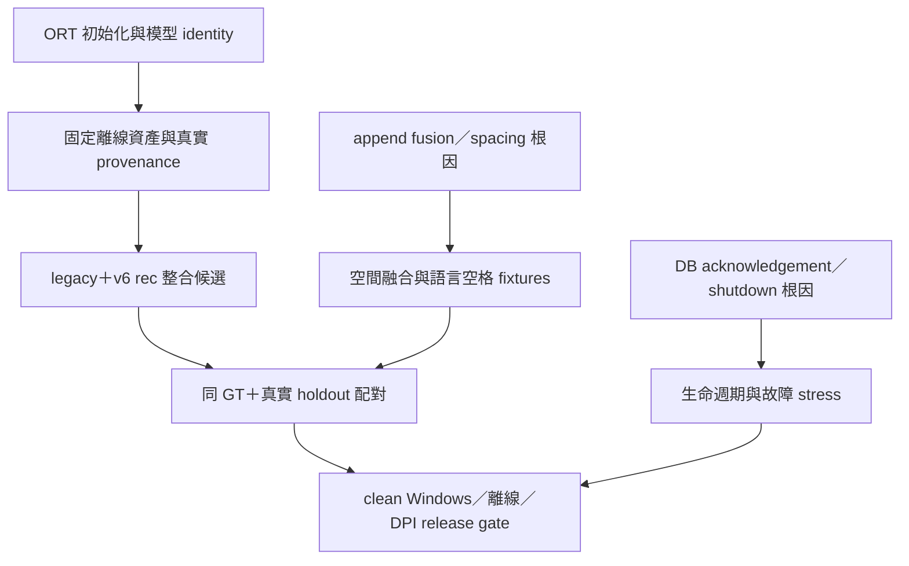

# 模型更新決策：第二階段配對驗證

審計基準：`maotai11/desktop-ocr-tool@f5af545cabc4e9a649cd57497fbf5bf42f2ff138`。日期：2026-10-02。產品原始碼、設定與正式模型未變更。CONFIRMED＝本批程式／實測證據；INFERRED＝候選解釋；UNKNOWN＝仍未驗證。

**建議把「保留 legacy Runtime、v4 detector／classifier，只替換為固定 SHA256 的 v6 small recognizer」列為下一個整合候選；尚未批准產品發布。** 這個候選已實際載入與推論，318 個固定裁切的 raw recognition 輸出與 modern v6 完全一致，公開表單及小字的 detection recall 保持基線。它可讓辨識模型改善與 Runtime API 遷移分開驗收。此候選是預定四組之後追加的探索性測量，仍有回歸案例與部署缺口。

**罕字問題仍未解決。** v6 在本批罕字的 CER 仍為47.92%，`尞、𠮷、𠀋` 未出現在載入的字表中。優先候選有12個crop從v4完全正確變成有誤，其中包含 `API`→`APl` 與日期時間空格丟失；本建議只適用下一步受控整合。

## 實測依據

| 候選 | 公開表單 CER | 合成挑戰 CER | 公開 detector IoU50 recall | 小字 detector IoU50 recall |
| --- | --- | --- | --- | --- |
| v4 基線 | 5.88% | 21.36% | 98.65% | 54.17% |
| v5 mobile | 3.45% | 11.56% | 78.83% | 100.00% |
| v6 small | 1.66% | 8.71% | 98.20% | 45.83% |
| v4 det＋v6 rec／modern | 1.66% | 8.71% | 98.65% | 54.17% |
| v4 det＋v6 rec／legacy | 1.66% | 8.71% | 98.65% | 54.17% |

Recognition 在相同 GT crops 上單獨量測，繞過 detection；表格 CER 使用產品現有 zh-hant 轉換後的字串。222 個公開 crops 來自 74 個欄位的三種 DPI，96 個合成 crops 用兩種繁中字型；不是 318 份獨立客戶文件。Detection recall 是選定框的一對一 IoU≥0.5，不是完整頁面的 precision。

v5 在公開表單的 union coverage≥80% 達 98.65%，高於其 IoU50 recall；因此其低 IoU 不能全部稱為「漏字」，框切分／合併差異需要另查。v6 小字 IoU50 recall 為 11/24，v4 為 13/24；這批資料不支持直接整套替換 detector。v5 在24張小字圖的IoU50 recall是24/24，值得保留為獨立detector實驗；它在公開表單的selected-field CER卻較差，尚不能作全域替代。兩組 v4-det／v6-rec 都保持 13/24，**仍然保留基線的小字漏偵測問題**。

## 候選處置

| 候選 | 處置與原因 |
| --- | --- |
| v4 全套 | 保留為 rollback 與配對 baseline；現有繁中／罕字限制仍在。 |
| v5 mobile 全套 | 暫不作優先整合：recognition 改善較少，本配置在 30×2000 失敗；公開欄位框匹配較差。不能推廣成所有 v5 配置皆失敗。 |
| v6 small 全套 | 暫不替換 detector：固定 crops 有改善，但小字 detection 低於基線，4K 10px文字仍不可靠。 |
| modern v4 det＋v6 rec | 保留為中期 Runtime 遷移對照：同 crops 與 legacy 組合相同，卻額外需要 API／包裝適配。 |
| legacy v4 det＋v6 rec | 優先進入受控整合驗證：保留已量測 detection 行為與 tuple contract；不等於證實 legacy 對任何未來模型都相容。 |

## 尚未通過的發布門檻

| Gate | 狀態 | 必須交付的證據 |
|---|---|---|
| 固定模型、字表、同 GT 配對 | CONFIRMED | identity.json、model SHA256、318 裁切配對、manifest hash |
| 公開表單與合成挑戰平均 CER | CONFIRMED | 本包 raw results；僅支持此 corpus |
| 客戶實際截圖／掃描／拍照資料 | UNKNOWN | 授權且去識別化資料、盲測 holdout、雙人 GT、金額／日期／姓名欄位 gate |
| 正確文字不被破壞 | 未全通過 | REGRESSION_CASES.md；不能用平均 CER 抵銷回歸 |
| 全產品 second-pass／fallback | UNKNOWN | 本輪固定 first pass；先解決 Phase1 O02／O03，再測組合與峰值 |
| Runtime provenance 與模型路徑 | 未修正 | Phase1 D01／O06；DB 必須寫實際 engine、model hash/version，而非固定 ppocrv4 |
| Microsoft telemetry／離線冷啟動 | 本輪 Linux benchmark 已隔離；產品未修正 | 所有 ORT imports 前 opt-out、固定依賴、Windows 網路／ETW 實測 |
| 打包／模型再散布權利 | UNKNOWN | exact model license／轉換來源鏈、固定 wheel hash、clean Windows 機器無網路安裝與啟動 |
| 500 次候選、secondary cold-load、UI／shutdown | UNKNOWN | 本輪不測候選長時間 leak／Windows lifecycle；沿用 Phase1 stress gate |
| p99／使用者機器效能 | UNKNOWN | 每圖兩次、每候選一次 process 不足 release 尾延遲驗收 |

沒有修改 UI 引擎選單、把模型複製到 production 或替換 requirements。PaddleOCR／CnOCR 的第一階段證據及限制仍保留；本階段沒有以未跑的 provider 宣稱勝出。

## 建議修正依賴順序

第一批修改以可分別回退的小範圍修正為界：telemetry 初始化、真正接線的模型 path／hash／provenance。完成後才接入固定 v6 rec 候選。Fusion、spacing、DB lifecycle 有不同根因，需自己的 fixture／stress gate；不因更換模型就視為已修好。字典 correction 仍採具上下文的建議與可追溯修改，不能用「己→已」或「NTS→NT$」全域替換補 benchmark。

完整數字、失敗與 API 證據見 PHASE2_RESULTS.md；Microsoft 與新 socket attempt 見 NETWORK_FOLLOWUP.md。此結論是**模型候選選擇**，不是 production readiness 宣告。
